# Election Violence Monitor (EVM)
## Complete Technical & Product Documentation
### Confidential — Internal Team Use Only

**Version:** 1.0 (Prototype Stage)
**Live URL:** https://election-violence-monitor.vercel.app
**GitHub:** https://github.com/devjadiya/election-violence-monitor
**Built by:** Dev Jadiya (https://github.com/devjadiya)
**Classification:** Confidential — Wikimedia / NGO Community Project

---

## Table of Contents

1. Problem Statement
2. Why Election Violence Documentation Matters
3. Solution Overview
4. What Is Available in the Market — Competitors
5. Who Benefits
6. Technology Stack — Choices and Rationale
7. System Architecture (High-Level Design)
8. Database Schema (Low-Level Design)
9. AI Pipeline — How Gemini Is Used
10. Ingestion Pipeline — How Articles Become Incidents
11. Why Upstash Redis — Purpose and Usage
12. Why Supabase — Purpose and Tables
13. Authentication & RBAC — 6 Role System
14. User Flow — All 6 User Types
15. Dashboard Feature Guide
16. Public Site Feature Guide
17. API Reference
18. Security Measures
19. Data Privacy & CC0 License
20. Performance Optimization Techniques
21. Current Dummy/Seed Data
22. Open Source Technology Breakdown
23. Current Status & Known Limitations
24. Future Work Roadmap
25. Mermaid Diagrams (10+)

---

# PART 1: CONTEXT & PROBLEM

---

## 1. Problem Statement

Elections are the cornerstone of democratic governance. However, in many countries — particularly across Africa, South Asia, Southeast Asia, and Latin America — elections are accompanied by systematic violence that undermines the democratic process itself. This violence targets voters, candidates, journalists, electoral officials, and civil society members.

**The core problem is not that this violence happens — it is that it is not captured.**

Currently:
- Violence incidents are reported in local newspapers but never aggregated
- No structured, searchable, cross-country database of election violence exists in open access
- Civil society organisations rely on manual, WhatsApp-based, ad hoc reporting
- Post-election analysis is impossible because no pre-election baseline exists
- Academic researchers must scrape news archives manually, introducing bias
- International election observers produce reports that disappear into PDF archives
- No machine-readable, API-accessible dataset exists that links incidents to Wikidata entities

**The result:** Policymakers cannot measure trends. Researchers cannot study patterns. NGOs cannot evidence-base their advocacy. Voters cannot access information about safety at polling units.

---

## 2. Why Election Violence Documentation Matters

### 2.1 The Global Scale

According to the Armed Conflict Location & Event Data Project (ACLED), political violence around election periods has increased in 47 of 65 countries monitored since 2016. Yet no single open, structured, freely-licensed global dataset captures election-specific violence.

### 2.2 The Nigerian Context (Pilot Country)

Nigeria — the most populous democracy in Africa — has held multiple elections since 1999 with documented patterns of:
- Ballot box snatching (especially in Southeast and South-South zones)
- Political assassinations during campaign periods
- Security force misconduct at polling units in the North
- Post-result violence after disputed governorship elections
- Systematic voter intimidation targeting women and minorities

INEC (Independent National Electoral Commission) does not publish incident databases. Civil society groups like Yiaga Africa collect some data but it is not machine-readable, not linked to geographic coordinates, and not available via API.

### 2.3 Why Documentation = Accountability

Documentation creates accountability in two ways:

**Forward accountability:** When actors know their actions are being documented and published, deterrence increases. The mere existence of a monitoring system changes behaviour.

**Backward accountability:** Documented incidents can be used in court proceedings, election petition tribunals, and international human rights reports. Without structured data, evidence is dismissed as anecdotal.

### 2.4 Alignment with International Frameworks

This project directly implements the framework from the *Global Election Violence Monitoring Project* document, which calls for:
- Structured incident categorisation (10 types)
- Demographic tracking of victims (gender, age, role, disability, minority group)
- Geographic hierarchy (country → region → district → community → polling unit)
- Verification workflow before publication
- CC0 open data licensing
- Wikidata integration for knowledge graph interoperability

---

## 3. Solution Overview

The Election Violence Monitor is a full-stack web platform that:

1. **Automatically detects** potential election violence incidents from trusted news sources using AI (Google Gemini)
2. **Structures and stores** incidents with rich metadata following the international monitoring framework
3. **Routes for human review** before any public publication (no automated publishing)
4. **Publishes verified incidents** to a public-facing website and open REST API
5. **Visualises on interactive maps** with geographic clustering and category filtering
6. **Exports in multiple formats** for researchers (CSV, JSON, Wikidata JSON-LD)
7. **Accepts public tips** anonymously from field observers and community members
8. **Tracks accountability** through follow-up actions (investigations, arrests, legal proceedings)

The system is not a judge. It is not a court. It does not attribute guilt. It documents what was reported in credible sources, applies structured categorisation, and makes that documentation freely accessible.

---

## 4. What Is Available in the Market — Competitors

### 4.1 Direct Competitors

| Platform | Coverage | Open Data | API | AI | Maps | Election-Specific |
|---|---|---|---|---|---|---|
| **ACLED** | Global | Partial (paid for full) | Paid | No | Yes | No — all conflict |
| **GDELT** | Global | Yes | Yes | No | No | No — all events |
| **V-Dem** | Global | Yes | No | No | No | Electoral but not incident-level |
| **Election Violence Education & Resolution (EVER)** | Academic | No | No | No | No | Yes but static |
| **Crisis24** | Commercial | No | Paid | Yes | Yes | No |
| **Armed Conflict Survey** | Academic | No | No | No | No | No |

### 4.2 Key Differentiators of EVM

- **Only platform** that is election-specific, AI-assisted, human-verified, AND open-licensed (CC0)
- **Only platform** with Wikidata entity linking for knowledge graph integration
- **Only platform** built to implement the specific demographic indicators from international monitoring standards (disability, ethnic/tribal group, religious group targeting)
- **Only platform** with a tip submission system for field observers
- **Fully open source** — code, schema, and data under free licenses
- **Designed for Wikimedia** ecosystem integration from the ground up

### 4.3 What ACLED Gets Right (and We Can Learn From)

ACLED is the gold standard for conflict data. Their strengths:
- Deep historical coverage (1997–present)
- 100+ trained regional analysts
- 24+ event types
- Monthly data releases

Their weaknesses relevant to EVM:
- Not free for commercial/institutional use
- Not election-cycle specific
- No victim demographic tracking
- No Wikidata integration
- No public tip submission
- Not designed for real-time monitoring

### 4.4 Market Positioning

EVM is not trying to replace ACLED. EVM is the **election-specific, Wikimedia-aligned, open-access layer** that sits on top of the broader conflict monitoring ecosystem. The target is: election observers, civil society, academic researchers, and the Wikimedia community — not institutional security analysts.

---

## 5. Who Benefits

### Primary Beneficiaries

**1. Election Observers (INEC, AU, EU, ECOWAS)**
Access to structured, geocoded incident data during and after elections. Can verify their own field reports against the system.

**2. Civil Society Organisations (Yiaga Africa, CLEEN Foundation)**
Evidence base for advocacy. Machine-readable data for grant reporting. API access for integration into their own platforms.

**3. Academic Researchers**
First-of-kind longitudinal dataset linking election violence incidents to Wikidata entities (elections, political parties, locations). CSV/JSON export for statistical analysis.

**4. Journalists**
Search and filter incidents by country, category, date. Public API. No login required.

**5. Grant Funders (Wikimedia Foundation, UN Democracy Fund, OSF)**
Transparent, auditable platform demonstrating structured impact measurement.

**6. Voters and Citizens**
Access to information about safety conditions at polling units in their area via the public map.

**7. International Bodies (UN, AU, EU)**
Structured data for election monitoring reports. Wikidata JSON-LD export for interoperability with UN data systems.

**8. Policymakers**
Analytics dashboards showing patterns — which regions, which election stages, which categories of violence are increasing — to inform electoral security policy.

---

# PART 2: TECHNOLOGY

---

## 6. Technology Stack — Choices and Rationale

### 6.1 Framework: Next.js 16.2.2 (App Router)

**Why Next.js instead of plain React or Express?**

Next.js App Router (released stable in 2023) enables Server Components — React components that render on the server without shipping JavaScript to the browser. For a data-heavy application like EVM:

- Dashboard pages fetch from DB on the server — no client-side loading spinners for data
- Public report pages are pre-rendered with real incident data — fast for search engines
- API routes live in the same codebase — no separate Express server needed
- Vercel deployment is trivially simple — push to GitHub, auto-deploy

**Turbopack** (Next.js's new bundler, replacing Webpack) makes local development builds 10x faster. EVM uses it in development via `next dev --turbopack`.

**Why not plain React (Vite + Express)?**
We would need to manage two separate deployments (frontend + backend), CORS between them, and client-side data fetching everywhere. Server Components eliminate this complexity.

**Why not Remix or SvelteKit?**
Next.js has the largest ecosystem, best Vercel integration (same company), and most community resources. For a project that needs to be handed over to a community team, Next.js is the safest choice.

### 6.2 Database: PostgreSQL via Supabase

**Why PostgreSQL?**
- ACID compliance — critical for audit logs and incident status tracking
- Full-text search with trigram indexes — used for incident search
- JSONB columns — used for audit log `previousData` and `newData`
- PostGIS extension available for future geospatial queries
- Widely understood by database administrators

**Why Supabase specifically?**
Supabase provides managed PostgreSQL with:
- Connection pooling via PgBouncer (critical — Vercel serverless functions create many short-lived connections)
- Row-Level Security (RLS) for future frontend-direct queries
- REST API auto-generated from schema (backup if Prisma unavailable)
- Realtime subscriptions (future notifications)
- Free tier sufficient for prototype stage
- Dashboard for manual SQL execution (critical — `prisma db push` fails through pooler)

**Important technical note:** Supabase's pooler (port 6543) must be used for all Prisma connections. The direct connection (port 5432) is only used for migrations. The `DATABASE_URL` must include `?pgbouncer=true&connection_limit=1`.

### 6.3 ORM: Prisma 5.22.0

**Why Prisma instead of raw SQL or Drizzle?**
- Type-safe queries — TypeScript types generated from schema
- Schema-as-code — the `schema.prisma` file IS the database documentation
- Migrations — track schema changes over time
- Prisma Client is auto-generated and includes full TypeScript autocomplete

**Why not Drizzle?**
Drizzle is newer and has better performance benchmarks. But Prisma has far better documentation, a more stable ecosystem, and Prisma Studio (visual database browser). For a project that non-developers may maintain, Prisma's DX is superior.

**Critical production configuration:**
```
binaryTargets = ["native", "rhel-openssl-3.0.x"]
```
Vercel runs on Linux (rhel-openssl-3.0.x). Local development runs on Windows/macOS (native). Both targets must be specified or the production build will fail with "Query Engine not found."

The `package.json` build script must be: `"build": "prisma generate && next build"` because Vercel's `pnpm approve-builds` blocks Prisma's postinstall script.

### 6.4 Authentication: NextAuth v5 beta

**Why NextAuth?**
- Purpose-built for Next.js
- JWT strategy — stateless, works on Vercel Edge
- Credentials provider — username/password authentication
- Built-in session management
- TypeScript-first

**Why JWT strategy instead of database sessions?**
Database sessions require a DB query on every request. JWT strategy decodes the token locally — no DB call needed to verify who is logged in. For a read-heavy platform with many public users, this is significantly faster.

**The bcrypt password story:**
Initial versions stored plaintext passwords (development shortcut). Phase 1 upgrade added bcrypt with cost factor 12. The auth system supports both — if password starts with `$2` it's bcrypt, otherwise it's plain text — allowing graceful migration without forcing all users to reset.

**Important NextAuth v5 beta quirk:**
NextAuth v5 requires `AUTH_SECRET` env variable, not `NEXTAUTH_SECRET`. Both must be set to the same value in production. This caused the first deployment to fail.

### 6.5 AI: Google Gemini 1.5 Flash via Vercel AI SDK

**Why Gemini Flash instead of GPT-4?**
- Cost: Gemini Flash is free tier up to 15 RPM, 1M tokens/day — sufficient for prototype
- Speed: Flash model optimised for high-throughput classification tasks
- Structured output: Vercel AI SDK's `generateObject` with Zod schema gives guaranteed typed JSON responses — no parsing required
- Google's model has strong performance on non-English text (important for multilingual future)

**Why not OpenAI?**
API costs. For a Wikimedia/NGO community project, free tier matters.

**Two-pass design explained:**
- Pass 1 costs ~200 tokens (quick filter — is this election violence?)
- Pass 2 costs ~1000 tokens (deep extraction — what exactly happened?)
- Only articles that pass Pass 1 run Pass 2
- This saves ~80% of API quota compared to running deep extraction on all articles

### 6.6 Cache & Queue: Upstash Redis + QStash

See dedicated Section 11 for deep-dive.

**Summary:** Upstash Redis handles:
1. URL deduplication (7-day TTL — prevents same article becoming 5 incidents)
2. Rate limiting (sliding window algorithm)
3. Stats caching (5-minute cache on public API responses)

### 6.7 Maps: MapLibre GL + OpenFreeMap

**Why MapLibre instead of Google Maps or Mapbox?**
- **Free:** MapLibre GL JS is open source. OpenFreeMap tiles are free. Google Maps charges per 1000 map loads.
- **No API key required for tiles:** OpenFreeMap serves map tiles from `tiles.openfreemap.org` without authentication
- **Mapbox-compatible API:** MapLibre is a fork of Mapbox GL JS — all Mapbox documentation applies
- **Vector tiles:** Renders at any zoom level without pixelation

**OpenFreeMap tile style:**
`https://tiles.openfreemap.org/styles/liberty` — a clean, modern style based on OpenStreetMap data.

**Why not Leaflet?**
Leaflet uses raster tiles (PNG images). MapLibre uses vector tiles (math-rendered). Vector tiles support smooth rotation, 3D buildings, and arbitrary zoom levels. For a future geospatial analysis layer, vector is essential.

### 6.8 Charts: Apache ECharts

**Why ECharts instead of Chart.js or D3?**
- More chart types — including the heatmap and scatter plots planned for future
- Better mobile performance — canvas-based rendering
- Built-in responsive behaviour
- Strong data zoom interaction for timeline analysis

### 6.9 Deployment: Vercel (Hobby Plan)

**Why Vercel?**
- GitHub integration — push to master = automatic deploy
- Serverless functions — API routes become lambda functions automatically
- Edge network — CDN for static assets globally
- Cron jobs — daily ingestion at 9am UTC (free on Hobby with daily schedule)
- Environment variables — managed UI, no `.env` files in production

**Hobby plan limitations:**
- Cron jobs: Daily maximum frequency (0 9 * * *)
- Function timeout: 10 seconds (extended to 60s with `export const maxDuration = 60` for ingestion)
- Bandwidth: 100GB/month

---

## 7. System Architecture (High-Level Design)

### 7.1 The Three Layers

```
┌─────────────────────────────────────────────────────────────┐
│                    PRESENTATION LAYER                       │
│                                                             │
│  PUBLIC SITE              DASHBOARD               ADMIN     │
│  /                        /dashboard              /admin    │
│  /map                     /incidents              /users    │
│  /reports                 /review                 /settings │
│  /reports/[id]            /analytics                        │
│  /submit                  /livemap                          │
│  /about                   /elections                        │
│  /developers              /tips                             │
│                           /sources                          │
│                           /export                           │
└─────────────────────────────────────────────────────────────┘
                            │
                            ▼
┌─────────────────────────────────────────────────────────────┐
│                    APPLICATION LAYER                        │
│                                                             │
│  NEXT.JS API ROUTES                                         │
│  /api/incidents          /api/public/incidents              │
│  /api/incidents/[id]     /api/public/stats                  │
│  /api/elections          /api/export                        │
│  /api/tips               /api/ingest                        │
│  /api/notifications      /api/cron/ingest                   │
│  /api/wikidata           /api/admin/users                   │
│  /api/sources            /api/auth/[...nextauth]            │
│                                                             │
│  SERVICES                                                   │
│  AI Classifier           Rate Limiter                       │
│  Ingestion Pipeline      Dedup Queue                        │
│  Notification System     Wikidata Library                   │
└─────────────────────────────────────────────────────────────┘
                            │
                            ▼
┌─────────────────────────────────────────────────────────────┐
│                    DATA LAYER                               │
│                                                             │
│  Supabase PostgreSQL     Upstash Redis                      │
│  (15 tables)             (dedup + rate limit + cache)       │
│                                                             │
│  External APIs                                              │
│  GDELT Project API       Nominatim (geocoding)              │
│  RSS Feeds               Wikidata SPARQL                    │
│  Google Gemini           OpenFreeMap tiles                  │
└─────────────────────────────────────────────────────────────┘
```

### 7.2 Request Flow — Public User Viewing Map

```
Browser → Vercel CDN
  → Next.js Server Component (map/page.tsx)
    → Prisma query → Supabase PostgreSQL
      → Returns incidents with lat/lng
    → Renders HTML with incident data
  → Browser receives HTML + tiny JS bundle
    → MapLibre GL loads (dynamic import, SSR disabled)
      → Fetches map tiles from OpenFreeMap CDN
        → Renders incident markers (batched via requestAnimationFrame)
```

### 7.3 Request Flow — AI Ingestion Pipeline

```
Vercel Cron (9am UTC) OR Manual trigger from /sources page
  → POST /api/cron/ingest (60s timeout)
    → Fetch articles from GDELT API (last 2 days, election violence keywords)
    → For each article:
      1. Check Upstash Redis: already processed? → skip
      2. Check DB: urlHash exists? → skip, mark in Redis
      3. Pass 1: Gemini Flash → is_election_related AND is_violence_related?
         → No? → mark processed, skip
         → Yes? → continue
      4. Pass 2: Gemini Flash → extract structured incident data
         → confidence < 40? → skip
      5. Nominatim geocoding → lat/lng coordinates
      6. Create Incident record (status: FLAGGED)
      7. Mark URL as processed in Redis (7-day TTL)
    → Log run to IngestionLog table
    → If incidents_created > 0: notify all admins via Notification table
  → Return summary JSON
```

---

## 8. Database Schema (Low-Level Design)

### 8.1 Complete Table Inventory

The EVM database has **15 tables** across 4 functional groups:

**Group 1: Auth & Users (4 tables)**
- `User` — system users with roles
- `Account` — OAuth provider accounts (NextAuth)
- `Session` — active sessions (NextAuth)
- `VerificationToken` — email verification tokens (NextAuth)

**Group 2: Core Domain (5 tables)**
- `Election` — registered elections being monitored
- `Incident` — the central entity — documented violence incidents
- `Victim` — demographic data per incident (anonymized)
- `Actor` — perpetrator groups per incident
- `FollowUp` — accountability actions post-incident

**Group 3: Sources & Ingestion (3 tables)**
- `MonitoredSource` — trusted news sources and RSS feeds
- `RawArticle` — every article ever fetched, with AI pass results
- `IncidentSource` — the sources cited for each incident (many-to-many bridge)
- `IngestionLog` — record of every ingestion run

**Group 4: Operations (3 tables)**
- `AuditLog` — immutable log of every change to every incident
- `TipSubmission` — anonymous public tips
- `Notification` — in-app notifications for dashboard users

### 8.2 The Incident Table — Most Important

The `Incident` table is the central entity. Every other table connects to it.

```
Incident
├── id (cuid — internal)
├── referenceId (EVM-2025-00001 — human-readable)
├── title
├── description (full text)
├── category (enum: 10 types)
├── status (enum: RAW→FLAGGED→UNDER_REVIEW→VERIFIED→PUBLISHED|REJECTED)
├── verificationStatus (CONFIRMED/UNCONFIRMED/UNDER_VERIFICATION)
├── electionStage (enum: 6 stages)
├── confidenceScore (0-100, from Gemini)
├── isAutoDetected (boolean — AI or manual)
│
├── LOCATION
│   ├── country, countryCode
│   ├── region, district, community, specificLocation
│   └── latitude, longitude (from Nominatim geocoding)
│
├── TIMING
│   ├── occurredAt (when it happened)
│   ├── reportedAt (when submitted)
│   ├── publishedAt (when made public)
│   └── rejectedAt
│
├── IMPACT
│   ├── fatalities, injured, arrested
│   ├── propertyDamage (boolean)
│   └── votingDisrupted (boolean)
│
├── weaponType (enum: 7 types)
├── wikidataId (Q-number for Wikidata linking)
│
├── RELATIONS
│   ├── electionId → Election
│   ├── createdById → User
│   └── reviewedById → User
│
└── CHILDREN
    ├── victims[] → Victim
    ├── actors[] → Actor
    ├── sources[] → IncidentSource
    ├── followUps[] → FollowUp
    ├── auditLogs[] → AuditLog
    └── rawArticles[] ← RawArticle (M2M)
```

### 8.3 The Victim Table — Demographic Tracking

Stores anonymised demographic data — never names or identifiers.

```
Victim
├── incidentId (FK → Incident, CASCADE DELETE)
├── role (VictimRole enum: VOTER/CANDIDATE/JOURNALIST/etc.)
├── gender (VictimGender enum: MALE/FEMALE/NON_BINARY/UNKNOWN)
├── ageGroup (AgeGroup enum: UNDER_18/AGE_18_25/etc.)
├── count (number of victims with these demographics)
├── nameAnonymized (always true — never store names)
├── hasDisability (boolean? — PDF Section 6d)
├── ethnicGroup (string? — PDF Section 6e)
└── religiousGroup (string? — PDF Section 6e)
```

### 8.4 The AuditLog Table — Immutability

Every status change, edit, and review action creates an AuditLog record. Records are never deleted.

```
AuditLog
├── incidentId → Incident
├── userId → User (who made the change)
├── action (AuditAction enum: CREATED/UPDATED/STATUS_CHANGED/etc.)
├── previousData (JSON — full previous incident state)
├── newData (JSON — full new incident state)
├── notes (text — reviewer notes)
├── ipAddress
└── createdAt
```

### 8.5 Table Connectivity Map

```
User ─────────────────────────────────────────┐
 ├── createdIncidents → Incident               │
 ├── reviewedIncidents → Incident              │
 ├── auditLogs → AuditLog                      │
 ├── tipSubmissions → TipSubmission            │
 └── notifications → Notification             │
                                               │
Election ──────────────────────────────────┐   │
 ├── incidents → Incident                  │   │
 └── sources → MonitoredSource             │   │
                                           │   │
Incident ──────────────────────────────────┘───┘
 ├── victims → Victim (CASCADE)
 ├── actors → Actor (CASCADE)
 ├── sources → IncidentSource (CASCADE)
 ├── followUps → FollowUp (CASCADE)
 ├── auditLogs → AuditLog
 └── rawArticles ←→ RawArticle (M2M: _IncidentArticles)

MonitoredSource
 └── rawArticles → RawArticle

RawArticle
 ├── source → MonitoredSource
 └── incidents ←→ Incident (M2M)
```

---

## 9. AI Pipeline — How Gemini Is Used

### 9.1 Overview

Gemini is used in exactly two places:
1. `pass1Screen()` — Quick binary classification
2. `pass2Extract()` — Deep structured extraction

Both functions live in `src/lib/ai/classifier.ts`.

### 9.2 Pass 1 — Screening (Low Cost)

**Input:** First 2000 characters of article title + content
**Output:** `{ isElectionRelated: boolean, isViolenceRelated: boolean, confidence: number }`
**Cost:** ~200 tokens per article
**Purpose:** Filter out irrelevant articles before running expensive Pass 2

**Zod schema for structured output:**
```typescript
const ClassificationSchema = z.object({
  isElectionRelated: z.boolean(),
  isViolenceRelated: z.boolean(),
  confidence: z.number().min(0).max(100),
})
```

The `generateObject()` function from Vercel AI SDK guarantees the response matches this schema. If Gemini returns anything else, it retries automatically. This eliminates all JSON parsing code.

**Pass 1 criteria (from prompt):**
- Election related: connected to election, voting, electoral process, or political campaign
- Violence related: describes violence, intimidation, attacks, or disruption
- Strict: only `true` if clearly relevant

**What gets filtered out:**
- General political news without violence
- Violence unconnected to elections (crime, domestic violence)
- Election commentary (opinion pieces, polling data)

Approximately **70-80% of articles are filtered by Pass 1**, saving significant API quota.

### 9.3 Pass 2 — Extraction (Higher Cost)

**Input:** First 4000 characters of article + title
**Output:** Fully structured incident data
**Cost:** ~1000 tokens per article
**Purpose:** Extract all structured fields needed for the Incident record

**Zod schema for structured output:**
```typescript
const DetailedSchema = z.object({
  category: z.enum([...10 categories...]),
  electionStage: z.enum([...6 stages...]),
  country: z.string().optional(),
  region: z.string().optional(),
  district: z.string().optional(),
  community: z.string().optional(),
  weaponType: z.enum([...7 types...]),
  fatalities: z.number().min(0).default(0),
  injured: z.number().min(0).default(0),
  victimRoles: z.array(z.string()).default([]),
  actorTypes: z.array(z.string()).default([]),
  summary: z.string(),          // 2-3 sentence factual summary
  confidence: z.number().min(0).max(100),
})
```

**Confidence score meaning:**
- 90–100: Article clearly describes a specific incident with precise details
- 70–89: Article describes incident but some details uncertain
- 50–69: Article mentions violence near election but connection unclear
- Below 50: Incident not created

### 9.4 Geocoding — Nominatim

After Pass 2 extracts location text (e.g. "Owerri West LGA, Imo State, Nigeria"), the `geocodeLocation()` function queries the Nominatim API (OpenStreetMap's geocoder) to get latitude/longitude.

```
geocodeLocation({ community, district, region, country })
  → Builds query string: "Umuguma Ward, Owerri West LGA, Imo State, Nigeria"
  → GET https://nominatim.openstreetmap.org/search?q=...&format=json&limit=1
  → Returns: { lat: 5.4836, lng: 7.0498 }
```

Nominatim is free, no API key required, but rate-limited to 1 request/second. The `User-Agent` header must be set — `ElectionViolenceMonitor/1.0` — or Nominatim will block the requests.

---

## 10. Ingestion Pipeline — Article to Incident

### 10.1 Two Source Types

**GDELT Project (Global Database of Events, Language, and Tone)**
- World's largest open database of news events
- Monitors 65,000+ news sources in 100+ languages
- API: `https://api.gdeltproject.org/api/v2/doc/doc`
- EVM queries: keywords related to election violence, English language, last 2 days, sorted by date
- Returns: article URL, title, publish date, source country, domain

**RSS Feeds**
- 18 trusted sources configured (see seeded data section)
- Nigerian outlets: Channels TV, Premium Times, Vanguard, Punch, Daily Trust, Sahara Reporters
- International: Reuters Africa, BBC Africa, Al Jazeera
- EVM fetches the 20 most recent articles per feed per run

### 10.2 The Deduplication Problem

The same incident may be reported by 5 different outlets. Without deduplication, one shooting in Port Harcourt could create 5 separate incident records.

EVM uses **two-layer deduplication**:

**Layer 1 — Upstash Redis (fast)**
- Key: `evm:dedup:{sha256_of_url_first_16_chars}`
- TTL: 7 days
- Check cost: ~1ms (network call to Upstash)
- This is checked FIRST — if hit, article is skipped immediately

**Layer 2 — PostgreSQL (fallback)**
- `RawArticle.urlHash` field: SHA-256 of the full URL
- `@unique` constraint prevents duplicate rows
- If Redis is unavailable, DB still prevents duplicates

Both layers run every time. Redis is faster but has a 7-day TTL. DB is permanent.

### 10.3 The Full Processing Pipeline

```
fetchGdeltArticles(keywords, maxRecords=30)
  ↓
For each article:
  1. isAlreadyProcessed(url) → Redis check
     → YES: return { created: false, reason: 'duplicate_redis' }
  
  2. DB check: prisma.rawArticle.findUnique({ where: { urlHash } })
     → EXISTS: markAsProcessed(url), return { created: false, reason: 'duplicate_db' }
  
  3. pass1Screen(title + content)
     → isElectionRelated=false OR isViolenceRelated=false?
       → Create RawArticle (for record-keeping), markAsProcessed, return
     → confidence < 50?
       → Same
  
  4. pass2Extract(content, title)
     → Returns null or confidence < 40?
       → Update RawArticle.isProcessed=true, return
  
  5. geocodeLocation(country, region, district, community)
     → Returns { lat, lng } or null
  
  6. Generate referenceId: EVM-{year}-{padded_count}
  
  7. prisma.incident.create({
       status: 'FLAGGED',
       isAutoDetected: true,
       confidenceScore: extracted.confidence,
       ...all extracted fields,
       latitude: coords?.lat,
       longitude: coords?.lng,
       sources: { create: { sourceUrl, sourceName, ... } },
       rawArticles: { connect: [{ id: rawArticle.id }] }
     })
  
  8. Update RawArticle.isProcessed = true
  9. markAsProcessed(url) → Redis TTL 7 days
```

### 10.4 Keywords Used for GDELT

```typescript
export const ELECTION_VIOLENCE_KEYWORDS = [
  'election violence Nigeria',
  'voter intimidation Nigeria',
  'ballot box snatching Nigeria',
  'INEC attack Nigeria',
  'polling unit disruption Nigeria',
  'electoral violence Africa',
  'campaign violence election',
  'political violence election Africa',
  'election official attacked',
  'election shooting Africa',
  'governorship election violence',
  'senatorial election violence Nigeria',
]
```

These keywords are OR-joined and sent to GDELT's full-text search API.

---

## 11. Why Upstash — Purpose and Usage

### 11.1 What is Upstash?

Upstash is a serverless Redis service. Unlike traditional Redis which requires a persistent server, Upstash Redis is accessed via HTTP — perfect for Vercel serverless functions which cannot maintain persistent connections.

### 11.2 Why Not Standard Redis?

Standard Redis requires a TCP connection that persists between requests. Vercel serverless functions are stateless and short-lived — they cannot maintain persistent connections. Upstash's HTTP-based REST API works perfectly in this environment.

### 11.3 Four Uses of Upstash in EVM

**Use 1: URL Deduplication (evm:dedup:* keys)**
```
Key format: evm:dedup:{16-char-sha256-of-url}
Value: "1"
TTL: 604800 seconds (7 days)
Purpose: Prevent same article from being processed twice
```

**Use 2: Rate Limiting (via @upstash/ratelimit)**
```
evm:public:api  → 100 requests/hour per IP (public incidents API)
evm:search      → 30 requests/minute per IP (incident search)
evm:tips        → 5 requests/hour per IP (tip submission)
evm:ingest      → 10 requests/day per IP (manual ingestion trigger)
```
Algorithm: Sliding window — counts requests in a rolling time window, not a fixed bucket.

**Use 3: Stats Caching (evm:stats:* keys)**
```
evm:stats:incident_count → cached for 300 seconds (5 minutes)
evm:stats:public         → cached for 120 seconds (2 minutes)
Purpose: Avoid DB query on every homepage load
```

**Use 4: QStash (Message Queue — configured but not fully activated)**
QStash allows background job processing with delivery guarantees. The architecture is in place for future use where ingestion jobs need to be queued and retried.

### 11.4 Upstash Configuration

```typescript
const redis = new Redis({
  url: process.env.UPSTASH_REDIS_REST_URL!,
  token: process.env.UPSTASH_REDIS_REST_TOKEN!,
})
```

The `@upstash/redis` client makes HTTP calls to Upstash's REST API. No TCP connection, no connection pooling needed.

---

## 12. Why Supabase — Tables and Connections

### 12.1 Connection Architecture

```
Vercel Function
    ↓ (DATABASE_URL with pgbouncer=true)
Supabase PgBouncer (port 6543)
    ↓ (connection pool, max 1 per function)
Supabase PostgreSQL (port 5432)
    ↓
Database: "postgres", Schema: "public"
```

**Why pgbouncer?**
Vercel creates a new serverless function instance for each request. Each function creates a new Prisma client. Without pgbouncer, this creates hundreds of direct PostgreSQL connections — PostgreSQL max_connections is ~100, so this would crash immediately. PgBouncer pools these connections — the database only sees 5-20 real connections while 200 functions share them.

**Why `connection_limit=1`?**
Each Prisma client in a serverless function should only hold 1 connection from the pool. If this is higher, a single Lambda function monopolises pool connections.

### 12.2 The DDL Paradox

`prisma db push` (which pushes schema changes to the database) hangs when connecting through the pgbouncer pooler. This is because pgbouncer is in transaction mode, and `db push` requires schema-level commands that need a real connection.

**Solution:** Always use the Supabase SQL Editor (Dashboard → SQL Editor) to run DDL statements directly. Use `prisma db generate` locally to update the TypeScript client.

### 12.3 Supabase Dashboard Usage

The Supabase dashboard is used for:
- Running DDL (CREATE TABLE, CREATE INDEX statements) directly
- Monitoring connection count (Table Editor → pg_stat_activity)
- Viewing data (Table Editor — visual database browser)
- Running one-off queries for debugging
- Managing Row-Level Security policies (future use)

---

## 13. Authentication & RBAC — 6 Role System

### 13.1 Role Hierarchy

```
PUBLIC (0) → OBSERVER (1) → ANALYST (2) → REVIEWER (3) → EDITOR (4) → ADMIN (5)
```

Each higher role inherits all permissions of lower roles. The `hasPermission()` function simply compares numeric values:

```typescript
export const ROLE_HIERARCHY: Record<UserRole, number> = {
  PUBLIC: 0,
  OBSERVER: 1,
  ANALYST: 2,
  REVIEWER: 3,
  EDITOR: 4,
  ADMIN: 5,
}

export function hasPermission(userRole: UserRole, requiredRole: UserRole): boolean {
  return ROLE_HIERARCHY[userRole] >= ROLE_HIERARCHY[requiredRole]
}
```

### 13.2 Role Permissions Matrix

| Action | PUBLIC | OBSERVER | ANALYST | REVIEWER | EDITOR | ADMIN |
|---|---|---|---|---|---|---|
| View public site | ✅ | ✅ | ✅ | ✅ | ✅ | ✅ |
| Submit anonymous tip | ✅ | ✅ | ✅ | ✅ | ✅ | ✅ |
| Access dashboard | ❌ | ❌ | ✅ | ✅ | ✅ | ✅ |
| View all incidents | ❌ | ❌ | ✅ | ✅ | ✅ | ✅ |
| Create incidents manually | ❌ | ❌ | ✅ | ✅ | ✅ | ✅ |
| Verify/reject incidents | ❌ | ❌ | ❌ | ✅ | ✅ | ✅ |
| Publish incidents | ❌ | ❌ | ❌ | ❌ | ✅ | ✅ |
| Edit published incidents | ❌ | ❌ | ❌ | ❌ | ✅ | ✅ |
| Manage sources | ❌ | ❌ | ❌ | ❌ | ✅ | ✅ |
| Trigger ingestion | ❌ | ❌ | ❌ | ❌ | ✅ | ✅ |
| Manage users | ❌ | ❌ | ❌ | ❌ | ❌ | ✅ |
| Change user roles | ❌ | ❌ | ❌ | ❌ | ❌ | ✅ |
| View audit logs | ❌ | ❌ | ✅ | ✅ | ✅ | ✅ |

### 13.3 Session & JWT

```
User logs in (POST /api/auth/callback/credentials)
  → NextAuth validates email + bcrypt password
  → Creates JWT token containing: { id, email, name, role }
  → JWT stored in httpOnly cookie (secure, not accessible to JS)
  → Each request: JWT decoded server-side in middleware
  → Session available via auth() in Server Components
```

The JWT contains the role claim directly — no DB call needed to check permissions on every request.

### 13.4 Seed Users

| Role | Email | Password | Name |
|---|---|---|---|
| ADMIN | dev.wikipedia@gmail.com | admin123456 | Admin |
| EDITOR | editor@evm.org | password123 | Sarah Okonkwo |
| REVIEWER | reviewer@evm.org | password123 | James Adeyemi |
| ANALYST | analyst@evm.org | password123 | Amina Bello |
| OBSERVER | observer@evm.org | password123 | Chidi Nwosu |
| OBSERVER | observer2@evm.org | password123 | Grace Mensah |

All passwords are stored as bcrypt hash with cost factor 12.

---

## 14. User Flow — All 6 User Types

### 14.1 PUBLIC User (Anonymous visitor)

```
Visit https://election-violence-monitor.vercel.app
  ├── Homepage → Read statistics, click Live Map or Browse Reports
  ├── /map → View MapLibre interactive map
  │     ├── Filter by incident category (buttons)
  │     ├── Click marker → popup with title, deaths, injuries, confidence
  │     └── Click "Read Full Report" → /reports/{id}
  ├── /reports → List of published incidents with filters
  │     ├── Filter by country, category
  │     ├── Paginate (20 per page)
  │     └── Click incident → /reports/{id}
  ├── /reports/{id} → Full public report
  │     ├── Incident details (anonymized)
  │     ├── Victim demographics (no names)
  │     ├── Follow-up actions (if any)
  │     ├── Sources cited
  │     └── Election context
  ├── /submit → Submit anonymous tip
  │     ├── Fill description, location, date, category
  │     ├── Toggle anonymous/non-anonymous
  │     └── Submit → confirmation page
  ├── /about → Methodology, ethics, indicators
  └── /developers → API documentation
```

### 14.2 OBSERVER User

```
Login → /dashboard
  ├── View dashboard (read-only stats, no actions)
  ├── View incidents list (cannot edit or review)
  └── Submit tip via dashboard form
```
Observers are field reporters who can see the system and submit tips but cannot review or publish.

### 14.3 ANALYST User

```
Login → /dashboard
  ├── Dashboard → Full stats, charts, calendar
  ├── Incidents → View all incidents at all statuses
  │     ├── Create new incident (manual entry)
  │     │     ├── Fill all form fields
  │     │     ├── Link to election (dropdown)
  │     │     ├── Enter victim demographics
  │     │     ├── Enter actor type
  │     │     └── Submit → FLAGGED status
  │     └── View incident detail (read-only status changes)
  ├── Analytics → All 10 PDF indicators
  ├── Elections → View elections list
  └── Search incidents (topbar search)
```

### 14.4 REVIEWER User

```
Login → /dashboard
  ├── Review Queue → See all FLAGGED and UNDER_REVIEW incidents
  │     └── Click incident → detail page
  ├── Incident Detail
  │     ├── Read description and sources
  │     ├── Flag for Review → FLAGGED
  │     ├── Start Review → UNDER_REVIEW
  │     ├── Verify → VERIFIED (but cannot Publish)
  │     └── Reject → REJECTED
  ├── Add follow-up actions (investigations, arrests)
  └── Link to Wikidata entity
```

### 14.5 EDITOR User

```
Login → /dashboard
  ├── All Reviewer capabilities PLUS:
  ├── Publish → moves VERIFIED → PUBLISHED (public visibility)
  ├── Edit any incident (edit form with all fields)
  ├── Manage Sources → add/remove RSS feeds
  ├── Run Ingestion → trigger manual GDELT + RSS fetch
  └── View ingestion log
```

### 14.6 ADMIN User

```
Login → /dashboard
  ├── All Editor capabilities PLUS:
  ├── Admin → Users
  │     ├── View all users
  │     ├── Add new user (set name, email, password, role)
  │     ├── Edit user role (dropdown)
  │     └── Deactivate user (toggle active/inactive)
  ├── Admin → Settings
  │     ├── Profile & Password (change own password)
  │     ├── System (AI model, schedule, DB status)
  │     ├── Notifications (toggle notification types)
  │     ├── Security (password hashing, RBAC status)
  │     └── API Access (endpoint documentation)
  └── Receive all notifications (tips, new incidents, ingestion results)
```

---

## 15. Dashboard Feature Guide

### 15.1 Dashboard Home (/dashboard)

**Stats Grid (6 cards):**
- Total Incidents (all statuses)
- Published (publicly visible)
- Pending Review (FLAGGED + UNDER_REVIEW)
- Fatalities (sum across all published)
- Injured (sum across all published)
- Detection Rate (published / total × 100)

**Tip Alert Banner:** Orange banner shows count of unreviewed tips. Clicking goes to /tips.

**Recent Incidents:** Last 8 incidents created, with status badges and election link.

**Quick Actions:** New Incident, Review Queue, Export Data, Manage Sources.

**Election Calendar:** Upcoming active elections with countdown (red if <30 days, orange if <90 days).

**AI Confidence Widget:** Bar chart showing distribution of confidence scores (0-49%, 50-74%, 75-100%). Shows AI Detected vs Manual counts.

### 15.2 Incidents (/incidents)

**List view** with status filter tabs (All, Flagged, Under Review, Verified, Published, Rejected).
Each row: reference ID, title, category badge, status badge, country, date, actions.

**New Incident (/incidents/new):**
- Linked Election dropdown (auto-fills country)
- Title, description, category, election stage
- Location: country, region, district, community, lat/lng, specific location
- Impact: fatalities, injured, arrested, property damage, voting disrupted, weapon type
- Victim info: role, count, gender, age group, disability, ethnic group, religious group
- Actors: perpetrator type, party/org name
- Source: name + URL
- Monitoring notice: explains this creates a flagged record for review

**Incident Detail (/incidents/{id}):**
- Left panel: description, impact metrics, victim demographics, actor info, sources (with corroboration count), follow-up actions, audit log
- Right panel: location, classification (stage, confidence, verification, source type), election link, Wikidata link, record metadata (created by, reviewed by, dates)
- Action buttons: Edit, Flag/Review/Verify/Publish/Reject (context-sensitive)

**Edit Incident (/incidents/{id}/edit):**
Full form pre-filled from existing data. Changes logged in audit trail.

### 15.3 Review Queue (/review)

Shows incidents in FLAGGED and UNDER_REVIEW status. Each card shows: reference ID, title, category, country, confidence score, source count. Click to go to incident detail for action.

### 15.4 Analytics (/analytics)

10 indicators from PDF Section 12, organised in groups:

- **Indicator 1 (Total):** 7 summary stat cards
- **Indicator 1 (Trend):** Line chart — incidents by occurrence date (60-day window)
- **Indicators 2+3:** Country bar chart + Category donut chart
- **Indicators 9+8:** Election stage bar chart + Weapon type donut
- **Indicators 5+6+7:** Gender pie chart + Age group bar chart + Victim role bar chart
- **Indicator 10:** Accountability — incidents with confirmed follow-up responses
- **Data Quality statement:** AI vs manual, human review confirmation

### 15.5 Live Map (/livemap)

Internal dashboard map. Differences from public map:
- Shows ALL statuses (not just PUBLISHED)
- Shows FLAGGED incidents (analysts can see what AI detected)
- Category filter buttons in top-left
- Stats overlay (top-right): Incidents, Deaths, Injured, Countries
- Click legend to filter by category
- Popup: reference ID, category, status badge, stats, confidence, "View Full Details" link

### 15.6 Tips (/tips)

Pending tips first, reviewed tips second.
Each tip shows: anonymous badge, category badge, reviewed badge, description (truncated), location, date, time ago.
Actions: "Create Incident" (goes to /incidents/new?tip={id}) and "Mark Reviewed" (with optional review notes).

### 15.7 Elections (/elections)

Groups: Currently Monitoring (within 30-90 days), Upcoming, Past.
Each card: date box, name, country, type, Wikidata QID link, incident count badge, countdown.

### 15.8 Sources (/sources)

Shows last ingestion run status (green if success, red if errors — with error text).
Table: source name, URL, type (RSS/API), article count, trust score bar, last fetched time, active status.
"Run Ingestion Now" button triggers manual ingestion.
"Add Source" form: name, URL, RSS URL, country.

### 15.9 Export (/export)

Three download buttons:
- CSV: all published/verified incidents as spreadsheet
- JSON: all published/verified incidents as JSON array
- Wikidata JSON-LD: schema.org-compatible structured data

---

## 16. Public Site Feature Guide

### 16.1 Homepage (/)

- Fixed glassmorphism navbar with navigation links
- Hero section with animated "Live Monitoring Active" badge
- Live stats pulled from DB (incidents, countries, fatalities, injured)
- 6-feature grid (Map, AI Classification, Human Verification, Analytics, Privacy, Wikidata)
- Dark CTA section with "Submit a Tip" button
- Footer with all links and Dev Jadiya attribution

### 16.2 Public Map (/map)

- Fixed navbar + stats bar showing published count, fatalities, injured, mapped locations
- MapLibre GL map fills remaining viewport
- Category filter buttons (top-left)
- Stats pill overlay (top-right)
- Loading skeleton while map tiles download
- Marker progress indicator during batch rendering
- Legend (bottom-right) with clickable category filter
- Popup: category label, title, deaths/injured/confidence stats, "Read Full Report" link

**Performance notes:**
- Map loaded via `next/dynamic` with `ssr: false` (MapLibre requires browser APIs)
- Markers rendered in batches of 50 via `requestAnimationFrame` to avoid blocking main thread
- FitBounds uses safe loop instead of `Math.min(...array)` (spread operator causes stack overflow on 500+ items)

### 16.3 Reports (/reports)

- Filter bar: country buttons (top 8 by incident count) + category colour buttons
- Results info: "Showing 1–20 of 47 incidents in Nigeria"
- Incident cards: colour bar, reference ID, category badge, stage badge, source name, title, description preview, location, date, casualties
- Pagination: numbered pages with Previous/Next
- CC0 license note at bottom

### 16.4 Individual Report (/reports/{id})

- Breadcrumb navigation
- Two-column layout (main + sidebar)
- Main: header card (with colour bar, badges, title, location, description), impact metrics, victim demographics, recorded responses, sources list
- Source notice: "Publication does not constitute a legal or political determination"
- Sidebar: quick facts, election context, Wikidata link, data reuse notice (CC0), public API link

### 16.5 Submit Tip (/submit)

- Server component (for metadata) wrapping client form component
- "Do no harm" ethics notice
- Fields: description (required), location, date/time, category (optional)
- Privacy section: anonymous toggle, optional contact email
- Submitting shows loading spinner with "Submitting..." text
- Success page with Return Home / Submit Another options

---

## 17. API Reference

### 17.1 Public API (No Auth Required)

**GET /api/public/incidents**
```
Parameters:
  country   string  Filter by country (partial match, case-insensitive)
  category  string  Filter by IncidentCategory enum value
  from      string  ISO date filter (occurredAt >= from)
  to        string  ISO date filter (occurredAt <= to)
  page      number  Page number (default: 1)
  pageSize  number  Results per page (max: 100, default: 20)

Response:
{
  success: true,
  data: [Incident[]],
  meta: { total, page, pageSize, totalPages },
  license: "CC0 1.0 Universal",
  attribution: "Election Violence Monitor"
}

Rate limit: 100 requests/hour per IP
Cache: public, s-maxage=300
CORS: Access-Control-Allow-Origin: *
```

**GET /api/public/stats**
```
Response:
{
  total: number,
  fatalities: number,
  injured: number,
  byCategory: Record<string, number>,
  byCountry: Record<string, number>,
  byStage: Record<string, number>
}

Cache: public, s-maxage=60
```

**GET /api/export**
```
Parameters:
  format  "csv" | "json" | "wikidata"

Response: File download
- csv: text/csv
- json: application/json
- wikidata: application/ld+json (schema.org JSON-LD)
```

### 17.2 Authenticated API (Dashboard Use)

**Incidents**
```
GET    /api/incidents              List all incidents (with filters)
POST   /api/incidents              Create new incident
GET    /api/incidents/{id}         Get single incident with all relations
PATCH  /api/incidents/{id}         Update incident (status, fields)
POST   /api/incidents/{id}/followup Add follow-up action
GET    /api/incidents/search?q=    Full-text search
```

**Tips**
```
GET    /api/tips                   List all tips (auth required)
POST   /api/tips                   Submit tip (public, rate limited)
PATCH  /api/tips/{id}             Mark reviewed, add notes
```

**Notifications**
```
GET    /api/notifications          Get user notifications + unread count
PATCH  /api/notifications          Mark all as read
PATCH  /api/notifications/{id}    Mark single as read
DELETE /api/notifications/{id}    Delete notification
```

**Elections**
```
GET    /api/elections              List elections
POST   /api/elections              Create election
```

**Admin**
```
POST   /api/admin/users            Create user
PATCH  /api/admin/users/{id}      Update role/status/password
DELETE /api/admin/users/{id}      Deactivate user
```

**Auth**
```
POST   /api/auth/change-password   Change own password (bcrypt)
GET/POST /api/auth/[...nextauth]   NextAuth handlers
```

**Ingestion**
```
POST   /api/ingest                 Trigger manual ingestion (Editor+)
GET    /api/cron/ingest            Cron endpoint (Bearer token auth)
```

**Wikidata**
```
GET    /api/wikidata?qid=Q123      Fetch entity by QID
GET    /api/wikidata?country=Nigeria Fetch elections for country
```

### 17.3 Notification Triggers

| Event | Recipients | Type |
|---|---|---|
| New incident created (manual or AI) | All REVIEWER + EDITOR + ADMIN | review_needed |
| Tip submitted via /submit | All ADMIN + EDITOR | new_tip |
| Ingestion runs, finds incidents | All ADMIN + EDITOR | new_incident |
| Incident published | Incident creator only | incident_published |
| Incident rejected | Incident creator only | incident_rejected |

Notification bell polls every 30 seconds. Unread count shown as red badge.

---

## 18. Security Measures

### 18.1 Password Security

- bcrypt cost factor 12 — industry standard (takes ~300ms to hash — prevents brute force)
- Migration-safe: auth checks for `$2` prefix; if present → bcrypt compare; otherwise → plain text compare (for gradual migration)
- Minimum 8 characters enforced on change password form

### 18.2 HTTP Security Headers

Set both in `next.config.ts` and `vercel.json`:
```
X-Frame-Options: DENY                    — prevents clickjacking (iframe embedding)
X-Content-Type-Options: nosniff          — prevents MIME type sniffing
Referrer-Policy: strict-origin-when-cross-origin  — controls referer header
Permissions-Policy: camera=(), microphone=(), geolocation=()  — disables browser APIs
X-DNS-Prefetch-Control: on               — performance hint for browsers
```

### 18.3 Rate Limiting

All public-facing endpoints protected by Upstash sliding window rate limits:
- Public API: 100 req/hour per IP
- Search: 30 req/minute per IP
- Tip submission: 5 req/hour per IP
- Manual ingestion trigger: 10 req/day per IP

Exceeding returns HTTP 429 with Retry-After header.

### 18.4 Authentication Protection

- JWT httpOnly cookie — not accessible to JavaScript (prevents XSS token theft)
- `force-dynamic` on all dashboard pages — always server-rendered with auth check
- Middleware redirects unauthenticated users to /login
- All API routes check `await auth()` and return 401 if not authenticated

### 18.5 Admin Endpoint Protection

`hasPermission(userRole, 'ADMIN')` checked on all `/api/admin/*` routes. Non-admin gets HTTP 403.

### 18.6 Data Anonymization

- `Victim.nameAnonymized` always true — names never stored
- Public API and public reports page never returns: victim names, contact details, witness identities
- Tip contact email (if provided) stored only in DB, never returned via public API

### 18.7 CSRF Protection

NextAuth v5 uses SameSite cookie attribute. The JWT cookie is:
- httpOnly: true (no JS access)
- Secure: true in production (HTTPS only)
- SameSite: lax (protects against CSRF)

### 18.8 Input Validation

- Zod schemas validate all API request bodies
- Prisma's type-safe query builder prevents SQL injection (parametrised queries always)
- `description.length < 20` check on tip submission prevents empty submissions

---

## 19. Data Privacy & CC0 License

### 19.1 What Is CC0?

CC0 (Creative Commons Zero) is a public domain dedication. It means:
- Anyone can use, copy, modify, distribute the data
- No attribution required (though appreciated)
- No restrictions for commercial or research use
- Specifically designed for data and databases

EVM uses CC0 because the goal is maximum adoption by researchers, journalists, and civic technologists. Restrictive licenses would prevent the data from fulfilling its purpose.

### 19.2 What Data Is CC0 Licensed

All **published incident data** is CC0:
- Incident title, description, category, location, date, impact figures
- Victim demographic aggregates (no names)
- Actor type information
- Source URLs and names
- Follow-up actions
- Wikidata entity links

### 19.3 What Is NOT Published (Privacy Protection)

- Victim names (never stored)
- Witness identities (never stored)
- Tip submitter contact details (stored only in DB, never in public API)
- User account data (stored in DB, never exposed)
- Internal audit log details (dashboard only, not public API)

### 19.4 The Do-No-Harm Principle

Every public-facing page, API response, and data export includes a notice:
> "Publication of this record is for monitoring purposes only. It does not constitute a legal finding, political determination, or attribution of responsibility."

The system documents what credible sources reported — not what was proven.

### 19.5 GDPR Considerations (Prototype Stage)

- No cookies beyond the auth JWT cookie
- Auth cookie is httpOnly, used only for session management
- No analytics tracking (no Google Analytics, no tracking pixels)
- No email addresses collected from public users (tip submission is anonymous)
- Contact email on tips is optional and stored only in the DB

---

## 20. Performance Optimization Techniques

### 20.1 Server Components (Avoid Client-Side Fetching)

All dashboard pages use React Server Components. Data is fetched on the server before the page renders. The browser receives HTML with data already included — no loading spinners for initial page data.

```tsx
// This runs on the server — no JavaScript sent to browser for this query
export default async function DashboardPage() {
  const stats = await getDashboardStats()  // DB query on server
  return <StatsGrid stats={stats} />        // Rendered to HTML
}
```

### 20.2 Database Query Grouping (pgbouncer Awareness)

The dashboard was originally running 10+ parallel queries via `Promise.all`. With `connection_limit=1`, this saturated the pgbouncer pool on cold starts, causing random failures.

**Fix:** Queries are now grouped in 3 sequential batches (counts, aggregates, lists). Each batch uses `Promise.all` internally but batches run sequentially. This reduces peak connection usage from ~10 to ~3.

### 20.3 Suspense Boundaries for Widgets

Election Calendar and Confidence Overview widgets are wrapped in `<Suspense>`. If either widget's DB query fails (network issue, cold start), only that widget shows an error — the rest of the dashboard still renders.

```tsx
<Suspense fallback={<WidgetSkeleton />}>
  <ElectionCalendar />  {/* Independent server component */}
</Suspense>
```

### 20.4 Dynamic Import with SSR Disabled (MapLibre)

MapLibre GL requires browser APIs (`window`, `document`, WebGL). It cannot run during server-side rendering. Using `next/dynamic` with `ssr: false` tells Next.js to only load this component in the browser:

```tsx
const PublicMap = dynamic(() => import('./public-map'), {
  ssr: false,
  loading: () => <LoadingSpinner />
})
```

This prevents build failures and allows the rest of the page (nav, stats bar) to be server-rendered.

### 20.5 Batched Marker Rendering (requestAnimationFrame)

Creating 500 DOM nodes synchronously blocks the browser's main thread, causing the UI to freeze for 2-3 seconds. Fix: markers are created in batches of 50 using `requestAnimationFrame`, allowing the browser to paint between batches.

```typescript
function addBatch() {
  const end = Math.min(index + 50, data.length)
  for (let i = index; i < end; i++) {
    // create marker
  }
  index = end
  if (index < data.length) requestAnimationFrame(addBatch)  // yield to browser
}
requestAnimationFrame(addBatch)
```

### 20.6 Safe Array Operations (Stack Overflow Prevention)

`Math.min(...array)` uses the spread operator which passes array items as function arguments. JavaScript has a maximum call stack size. For 500+ items, this causes `RangeError: Maximum call stack size exceeded`.

**Fix:** Use a manual loop:
```typescript
let minLng = pts[0].longitude!
for (const p of pts) {
  if (p.longitude! < minLng) minLng = p.longitude!
}
```

### 20.7 CDN Preconnect Hints

```html
<link rel="preconnect" href="https://tiles.openfreemap.org" />
<link rel="dns-prefetch" href="https://tiles.openfreemap.org" />
```

These hints in `<head>` tell the browser to open TCP connections to map tile servers before the map JavaScript runs. Reduces map tile loading time by ~200-400ms.

### 20.8 Public API Caching

```typescript
headers: {
  'Cache-Control': 'public, s-maxage=300, stale-while-revalidate=60',
}
```

`s-maxage=300`: Vercel's CDN caches this response for 5 minutes.
`stale-while-revalidate=60`: While refreshing, serve stale content for up to 60 more seconds.

Result: Popular API endpoints are served from Vercel's edge cache without hitting the DB.

### 20.9 Loading Skeletons

Every major page has a `loading.tsx` file exporting animated skeleton placeholders. Next.js shows these automatically while the server component fetches data.

### 20.10 Try-Catch Defaults on DB Queries

All DB queries in widget components are wrapped in try-catch that returns empty defaults on failure. This means a DB timeout on one widget does not crash the entire page.

---

## 21. Current Dummy/Seed Data

All data is fictional, created for demonstration purposes. The seed file (`prisma/seeds/seed.ts`) creates:

### 21.1 Users (6 accounts)

See Section 13.4 for full list.

### 21.2 Elections (7 registered)

| Name | Country | Date | Type | Status |
|---|---|---|---|---|
| 2027 Nigerian General Elections | Nigeria | Feb 20, 2027 | General | Active |
| 2025 Anambra Governorship Election | Nigeria | Nov 8, 2025 | Gubernatorial | Active |
| 2027 Kenyan General Election | Kenya | Aug 9, 2027 | General | Active |
| 2024 Ghanaian General Election | Ghana | Dec 7, 2024 | General | Inactive |
| 2024 Bangladeshi General Election | Bangladesh | Jan 7, 2024 | General | Inactive |
| 2024 Indian General Election | India | Apr 19, 2024 | General | Inactive |
| 2024 Pakistani General Election | Pakistan | Feb 8, 2024 | General | Inactive |

### 21.3 News Sources (18 configured)

Nigerian sources: Channels TV, Premium Times, Punch, Vanguard, Daily Trust, The Nation, Sahara Reporters
International: Reuters Africa, BBC Africa, Al Jazeera, Voice of America Africa
Regional: The East African (Kenya), Daily Nation Kenya, MyJoyOnline (Ghana), Dawn (Pakistan), The Daily Star (Bangladesh), The Hindu (India), GDELT Project

### 21.4 Incidents (52 documented)

Geographically spread across 20+ countries:

**Nigeria (10 incidents):** Imo, Kogi, Rivers, Zamfara, Lagos, Abuja, Anambra, Kano, Kaduna, Delta — covering all 10 categories

**Africa (14 incidents):** Kenya, Ghana, Ethiopia, DRC, Cameroon, Mali, Senegal, Mozambique, Zimbabwe, Guinea, Togo, Somalia, Nigeria (more)

**Asia (8 incidents):** Bangladesh, India (3), Pakistan (3)

**Americas (5 incidents):** Venezuela (2), Mexico, Colombia, Haiti, Peru

**Other (3 incidents):** Philippines (2), Myanmar, Indonesia, Georgia (country), Iraq, Niger, Algeria, South Africa

**Status distribution:**
- PUBLISHED: ~40 incidents (publicly visible)
- VERIFIED: ~5 incidents
- UNDER_REVIEW: 1 incident
- FLAGGED: 1 incident
- RAW: 1 incident (lowest confidence)

**Includes:** 20 victim demographic records, 15 actor records, 10 follow-up actions, 3 sample tips (2 pending, 1 reviewed)

### 21.5 Geographic Coverage of Seed Data

All incidents have latitude/longitude coordinates, ensuring the map shows a globally-distributed dataset demonstrating the platform's cross-country capability.

---

## 22. Open Source Technology Breakdown

### 22.1 Fully Free & Open Source (100%)

| Category | Technology | License |
|---|---|---|
| Framework | Next.js | MIT |
| Language | TypeScript | Apache 2.0 |
| ORM | Prisma | Apache 2.0 |
| UI Components | shadcn/ui | MIT |
| Maps | MapLibre GL | BSD-3-Clause |
| Map Tiles | OpenFreeMap | ODbL (OpenStreetMap) |
| Charts | Apache ECharts | Apache 2.0 |
| Auth | NextAuth.js | ISC |
| Password | bcryptjs | MIT |
| Forms | React Hook Form | MIT |
| Validation | Zod | MIT |
| Dates | date-fns | MIT |
| Icons | Lucide React | ISC |
| HTTP | ky | MIT |
| RSS | rss-parser | MIT |
| CSV | PapaParse | MIT |
| Geist Font | Vercel Geist | SIL OFL |
| Toast | Sonner | MIT |

### 22.2 Free Tier / Freemium (0$ at current scale)

| Service | Free Tier |
|---|---|
| Vercel | Hobby plan — 100GB bandwidth, daily cron |
| Supabase | 500MB DB, 2 projects |
| Upstash Redis | 10,000 requests/day |
| Google Gemini | 15 RPM, 1M tokens/day |
| Nominatim | Free (OpenStreetMap geocoder) |
| GDELT | Free API, no limits |

### 22.3 Cost at Scale (When Free Tier Exceeded)

| Service | Cost at 10k incidents/month |
|---|---|
| Vercel Pro | $20/month |
| Supabase Pro | $25/month |
| Upstash Pay-as-you-go | ~$5/month |
| Google Gemini | ~$10/month |
| **Total** | **~$60/month** |

---

## 23. Current Status & Known Limitations

### 23.1 Current Status

**Working:**
- Full authentication (login, session, JWT, bcrypt)
- All 6 RBAC roles with correct permissions
- Complete incident CRUD (create, read, update, delete/reject)
- Review workflow (FLAGGED → UNDER_REVIEW → VERIFIED → PUBLISHED)
- Real notification system (30-second polling, mark read)
- Public map with batched markers and category filtering
- Dashboard with Suspense-isolated widgets
- Analytics with all 10 PDF indicators
- Elections registry with Wikidata search
- Tip submission (public + admin dashboard)
- Full-text search (topbar, debounced 300ms)
- CSV/JSON/Wikidata export
- Public API with rate limiting and CORS
- SEO metadata, robots.txt, sitemap.xml
- Mobile responsive (drawer nav + bottom nav)
- Error boundaries on all route groups
- Loading skeletons for all major pages

**Prototype Stage (works but limited):**
- AI ingestion: code complete, never run on real election → no real incidents yet
- Wikidata linking: manual QID entry works, SPARQL auto-reconciliation not implemented
- Notifications: polling works, WebSocket real-time not implemented

### 23.2 Known Issues

1. **`prisma db push` hangs** — use Supabase SQL Editor for all DDL
2. **Next.js 16 middleware deprecation warning** — `middleware.ts` → `proxy.ts` migration pending
3. **Vercel Hobby cron limit** — cannot run ingestion more than once/day
4. **Dashboard cold start** — first load after inactivity may be slow (Vercel serverless cold start ~2-3 seconds)
5. **Map tile loading** — OpenFreeMap tiles occasionally slow in some regions

### 23.3 Technical Debt

- No automated tests (Vitest configured but no tests written)
- No CI/CD pipeline (GitHub Actions not configured)
- Analytics charts need date range filter (hardcoded to 60-day window)
- Search results page (`/incidents?search=`) not implemented
- Bulk actions (bulk publish/reject) not implemented

---

## 24. Future Work Roadmap

### Phase 5 (Near-term)
- [ ] Real incident data from Nigerian 2025 Anambra election
- [ ] Email notifications (Resend/Nodemailer) for critical alerts
- [ ] Password reset via email flow
- [ ] Search results full page (/incidents?search=)
- [ ] Analytics date range filter

### Phase 6 (Medium-term)
- [ ] Automated Wikidata reconciliation (SPARQL match existing entities)
- [ ] Multilingual UI (Yoruba, Hausa, Igbo)
- [ ] Bulk review actions (select multiple, publish/reject)
- [ ] Print/PDF report per incident
- [ ] Wikimedia Toolforge deployment option
- [ ] WebSocket real-time notifications (replace polling)
- [ ] ACLED data import (historical baseline)

### Phase 7 (Long-term)
- [ ] Multiple country expansion (Kenya, Ghana, Bangladesh)
- [ ] Mobile app (React Native or Capacitor wrapper)
- [ ] Wikidata bot (auto-create/update Wikidata items from verified incidents)
- [ ] AI confidence self-improvement (human feedback loop on AI decisions)
- [ ] Pattern detection (alert when incident count in region exceeds threshold)
- [ ] Integration with UN OCHA HDX (Humanitarian Data Exchange)

---

# PART 3: DIAGRAMS

---

## 25. Mermaid Diagrams

Copy each code block and paste at https://mermaid.live to generate the diagram.

---

### Diagram 1: High-Level System Architecture

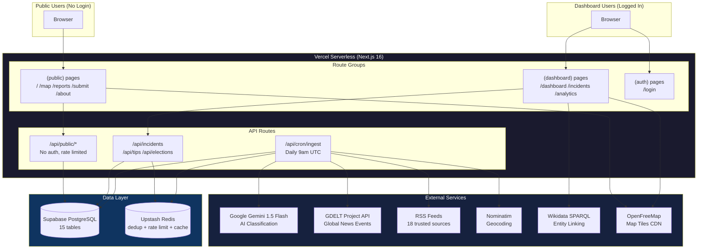

---

### Diagram 2: Incident Lifecycle (Status Workflow)

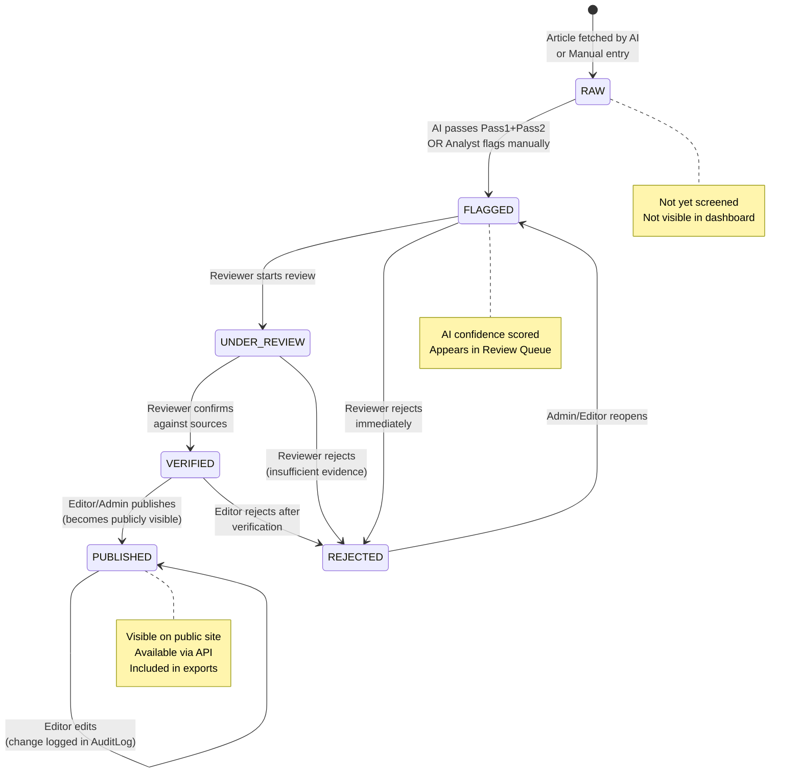

---

### Diagram 3: AI Two-Pass Classification Pipeline

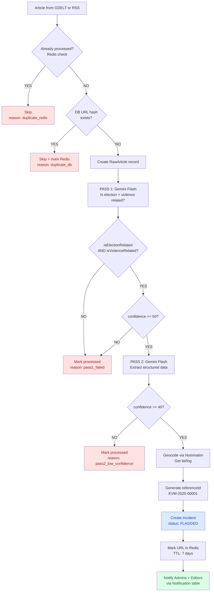

---

### Diagram 4: User Role & Permission Hierarchy

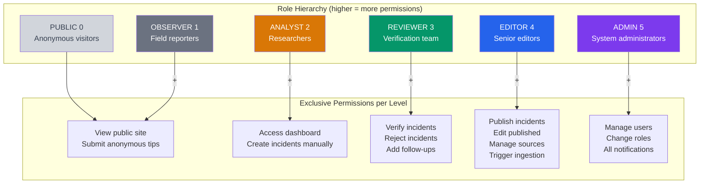

---

### Diagram 5: Database Entity Relationship Diagram

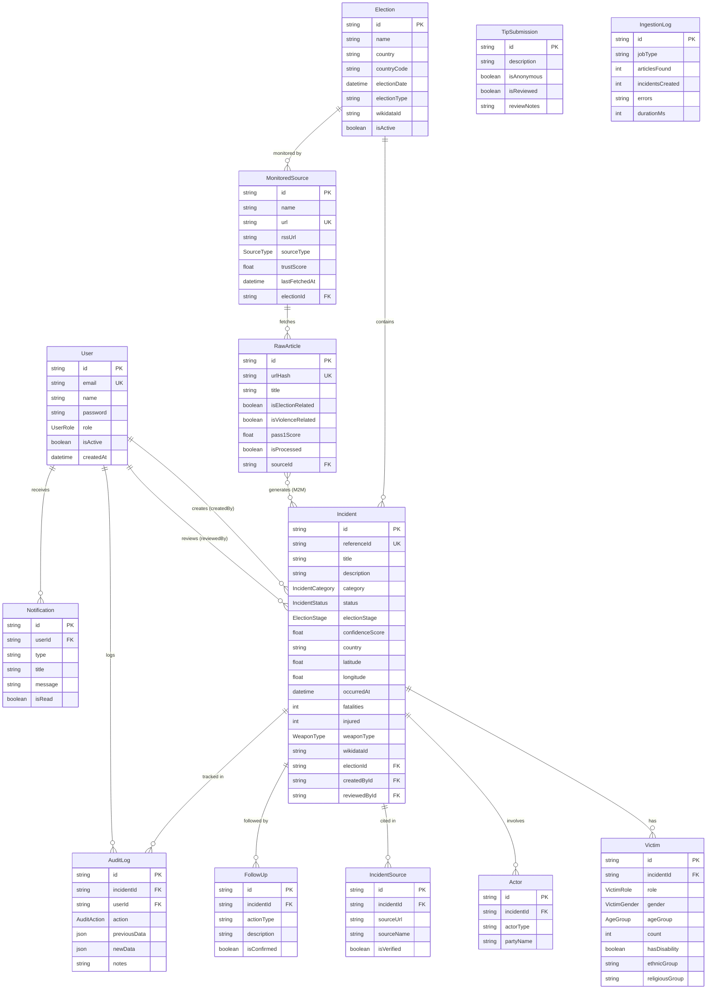

---

### Diagram 6: Upstash Redis Key Space and Usage

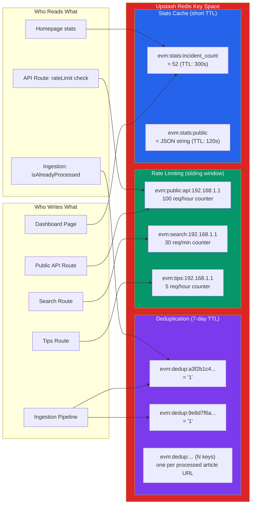

---

### Diagram 7: Public Site User Journey

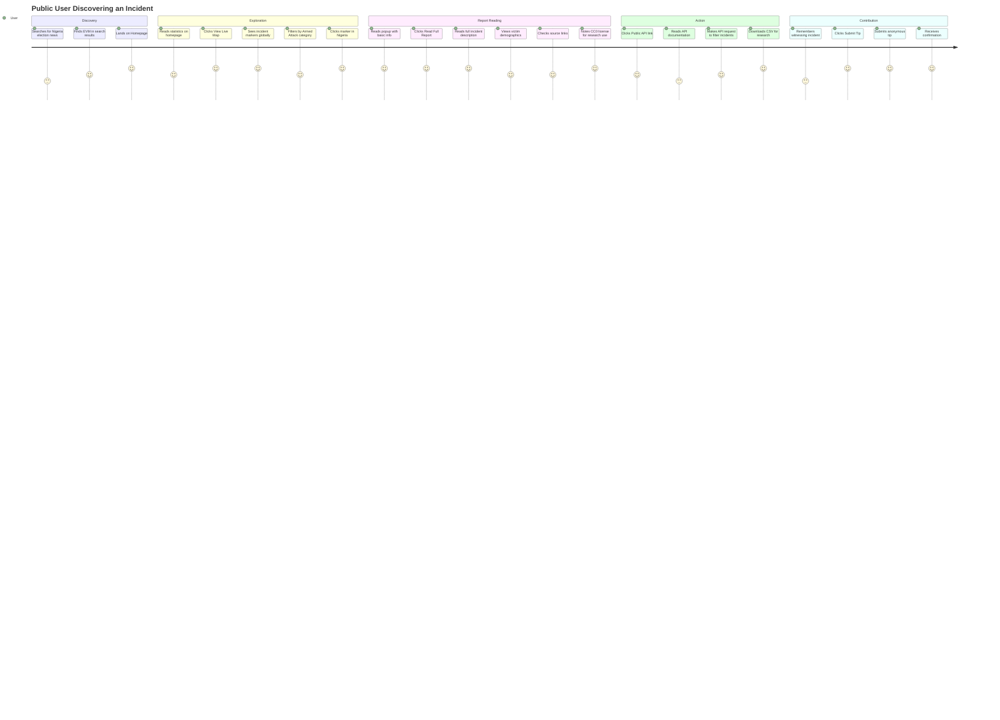

---

### Diagram 8: Notification System Flow

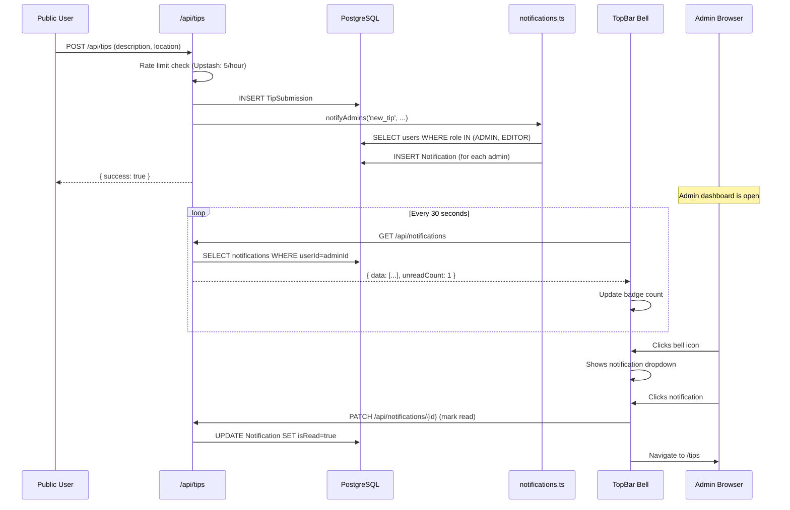

---

### Diagram 9: Authentication Flow (Login to Dashboard)

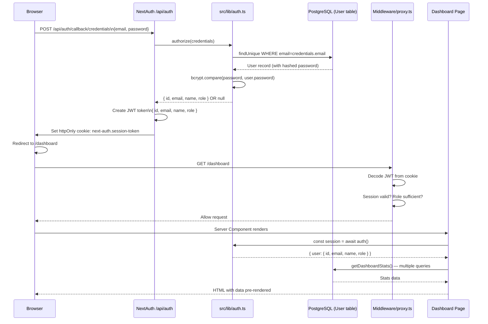

---

### Diagram 10: Ingestion Cron Job — Full Sequence

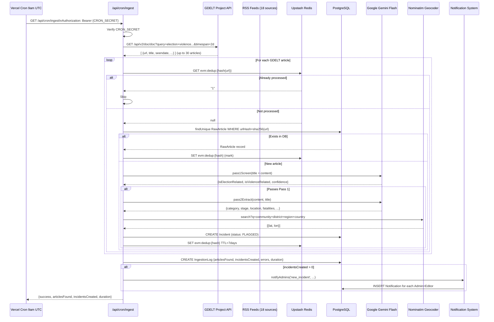

---

### Diagram 11: Public Map Data Flow (Performance Architecture)

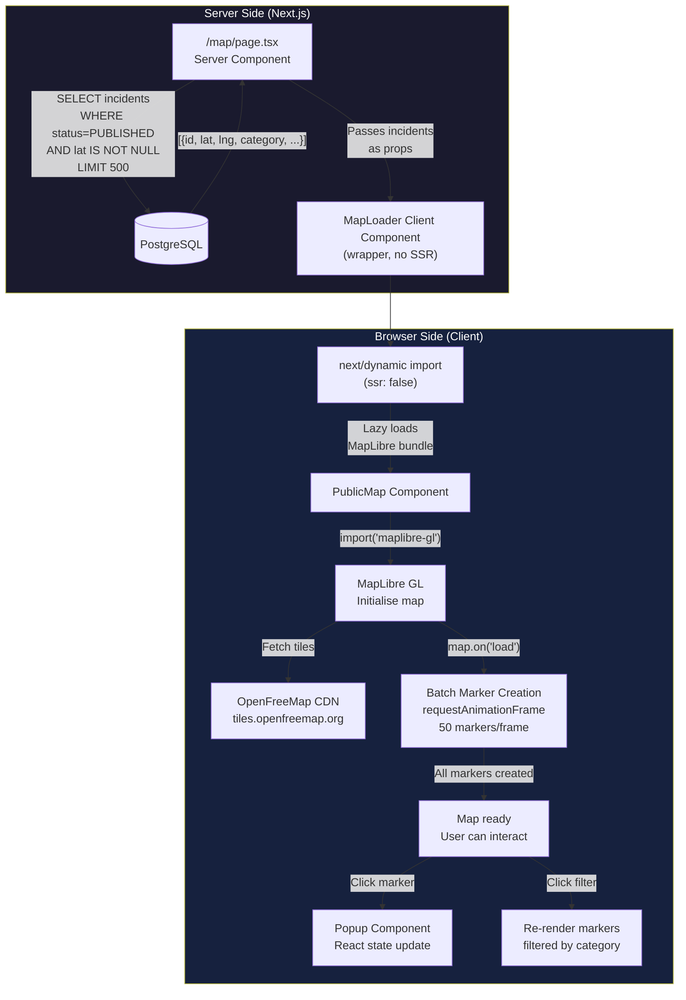

---

### Diagram 12: Data Privacy Architecture — What Is Public vs Private

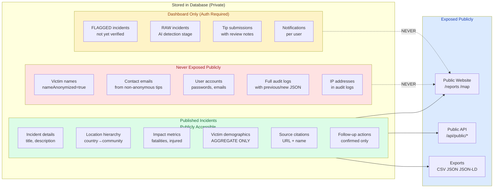

---

### Diagram 13: Deployment & Infrastructure

```mermaid
graph TB
    subgraph DEV["Development Environment"]
        LC[Local Machine\nWindows + Node.js 22\npnpm 10]
        GH[(GitHub Repository\ndevjadiya/election-violence-monitor)]
        LC -->|git push origin master| GH
    end

    subgraph VERCEL["Vercel Cloud (Production)"]
        BUILD["Build Process\n1. pnpm install\n2. prisma generate\n3. next build (Turbopack)"]
        subgraph SERVERLESS["Serverless Functions"]
            F1[Page routes\n/dashboard /incidents]
            F2[API routes\n/api/incidents /api/tips]
            F3[Cron function\n/api/cron/ingest\nMAX 60s"]
        end
        CDN["Vercel Edge CDN\nStatic assets globally"]
        GH -->|Auto-deploy on push| BUILD
        BUILD --> SERVERLESS
        BUILD --> CDN
    end

    subgraph EXTERNAL_SERVICES["External Services"]
        SB[("Supabase\nPostgreSQL\nap-northeast-1 (Japan)")]
        UR[("Upstash Redis\nGlobal Edge")]
        GM["Google Gemini API\nCloud AI"]
        OFM["OpenFreeMap\nTile CDN"]
    end

    SERVERLESS <--> SB
    SERVERLESS <--> UR
    F3 <--> GM
    CDN <--> OFM

    subgraph ENV["Environment Variables (Vercel Dashboard)"]
        E1["DATABASE_URL (pgbouncer)"]
        E2["NEXTAUTH_SECRET / AUTH_SECRET"]
        E3["GOOGLE_GENERATIVE_AI_API_KEY"]
        E4["UPSTASH_REDIS_REST_URL/TOKEN"]
        E5["CRON_SECRET"]
        E6["NEXT_PUBLIC_APP_URL"]
    end

    SERVERLESS --> ENV

    style VERCEL fill:#0a0a0a,color:#fff
    style EXTERNAL_SERVICES fill:#1a1a2e,color:#fff
    style DEV fill:#f3f4f6,color:#111
```

---

### Diagram 14: Complete Feature Map

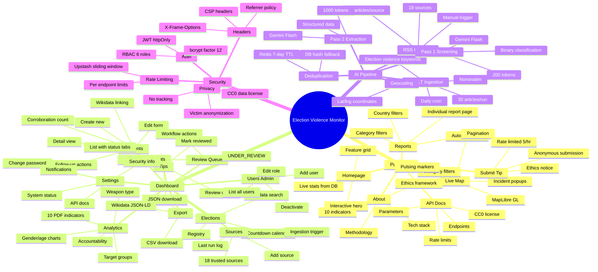

---

## Closing Notes for the Team

This document covers every technical and product decision made in the Election Violence Monitor from architecture to deployment. Key things to understand as you work with this system:

**The most important file:** `prisma/schema.prisma` — this IS the data model. Every table, field, relationship, and index is defined here. Read it to understand the database.

**The most important service:** `src/lib/ai/classifier.ts` — this is the core intelligence of the system. The two-pass Gemini design is the key innovation.

**The most important infrastructure decision:** Using pgbouncer with `connection_limit=1`. If you ever see DB connection errors in production, this is why. Never change this.

**The most important workflow:** The incident lifecycle — RAW → FLAGGED → UNDER_REVIEW → VERIFIED → PUBLISHED. Nothing reaches the public without passing through human review.

**The most important principle:** Do no harm. Victim names are never stored. Publication is for monitoring, not attribution. We document — we do not judge.

---

*Document maintained by Dev Jadiya*
*Last updated: April 2026*
*Project: Election Violence Monitor v0.1.0 (Prototype)*
*License: Codebase MIT, Data CC0 1.0 Universal*