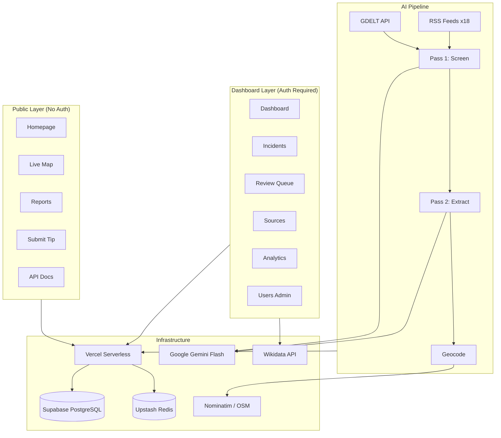
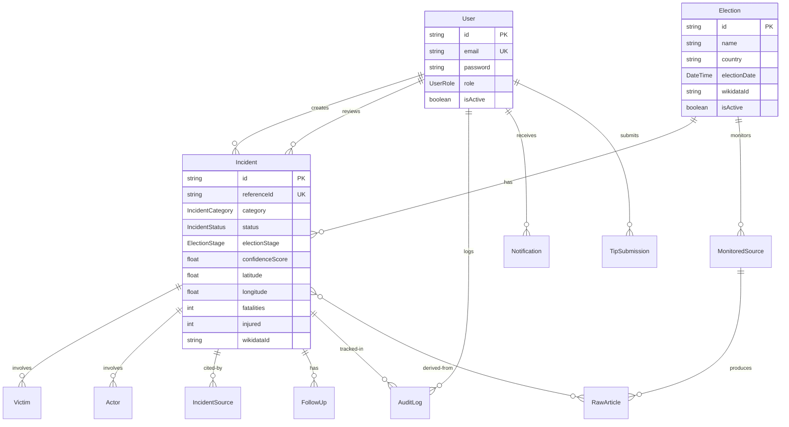
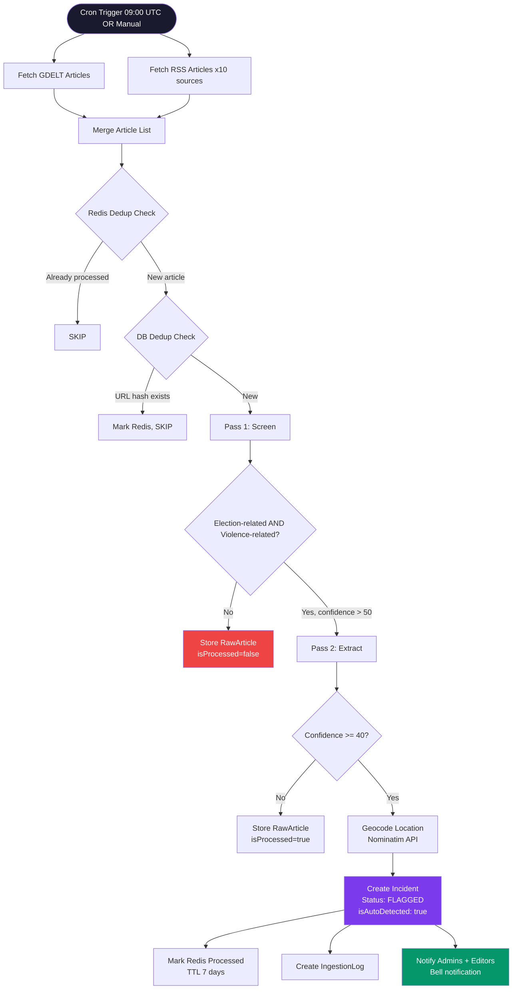
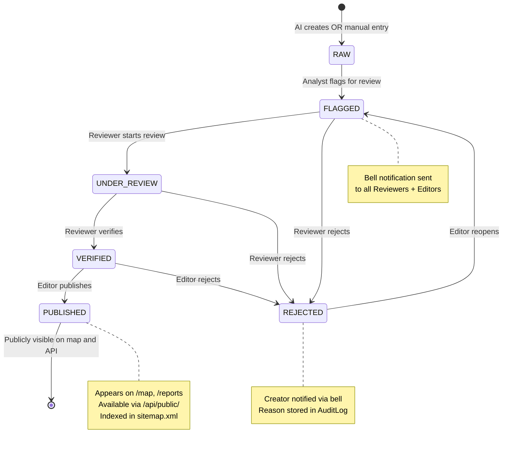
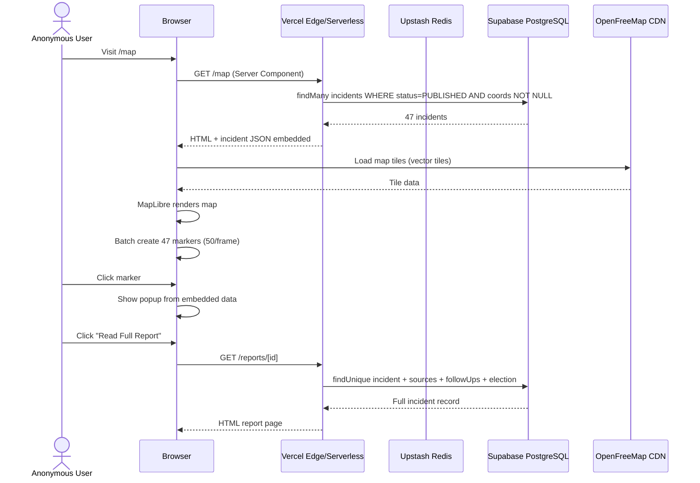
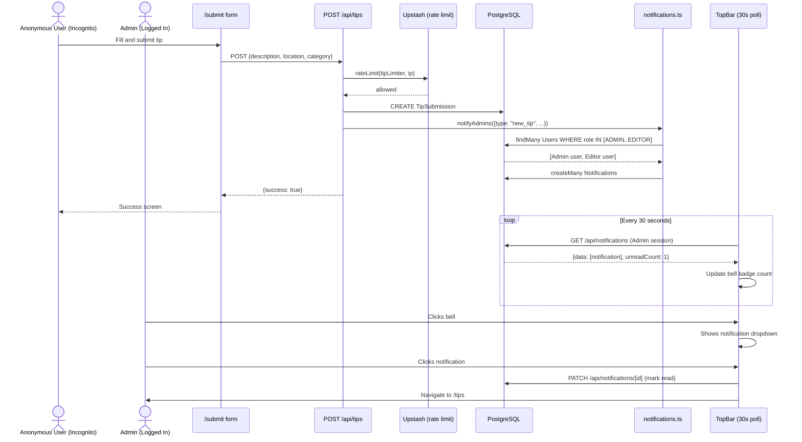
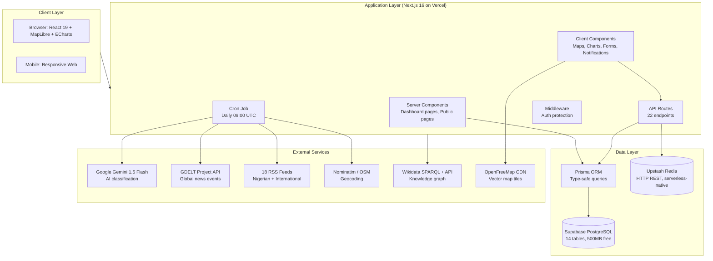
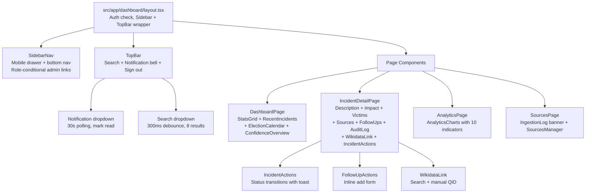

# Election Violence Monitor (EVM)
## Complete Technical & Product Documentation
### Confidential — Internal Team Use Only

**Version:** 1.0 — Prototype Stage
**Live URL:** https://election-violence-monitor.vercel.app
**GitHub:** https://github.com/devjadiya/election-violence-monitor
**Built by:** Dev Jadiya
**Status:** Production prototype — demo data active, real ingestion operational

---

# TABLE OF CONTENTS

1. Problem Statement
2. Why Election Violence Documentation Matters
3. What This System Is
4. Who Benefits
5. Market Landscape & Competitors
6. Solution Design & Why This Approach
7. Technology Stack — Every Choice Explained
8. System Architecture (High-Level)
9. Database Design — All 14 Tables
10. Authentication & RBAC — All 6 Roles
11. AI Pipeline — How Gemini Works Here
12. Ingestion Pipeline — End to End
13. Upstash Redis — Why & How
14. Supabase — Why & How
15. All API Endpoints Reference
16. User Flows — All 6 Role Types
17. Dashboard Feature Guide
18. Public Site Feature Guide
19. Security Measures & Optimization
20. Data Privacy, CC0, Do-No-Harm
21. Current Demo Data
22. Open Source Technologies Used
23. Known Limitations & Current Issues
24. Future Roadmap
25. Mermaid Diagrams (10 diagrams — paste each into mermaid.live)

---

# 1. PROBLEM STATEMENT

Elections are the foundation of democratic governance. Yet in many countries — particularly across Sub-Saharan Africa, South Asia, and parts of Latin America — elections are frequently accompanied by violence that:

- Physically prevents citizens from voting
- Intimidates voters, candidates, and election officials
- Destroys electoral infrastructure (ballot boxes, INEC offices, voting machines)
- Results in deaths, injuries, and arbitrary arrests
- Undermines public confidence in democratic institutions

**The documentation gap:** Despite the scale of this problem, there is no single structured, open, real-time database that:
- Captures incidents as they happen
- Classifies them consistently across categories
- Links them to specific elections and election stages
- Tracks victim demographics (gender, age, role, disability)
- Monitors follow-up accountability actions (arrests, prosecutions)
- Makes all data freely accessible to researchers, journalists, and NGOs

Existing solutions are fragmented: ACLED covers conflict broadly, GDELT tracks media events without human verification, and national bodies like INEC publish irregular reports without structured data.

**This leaves a critical blind spot:** patterns of election violence — who is targeted, when, where, with what weapons, and with what accountability response — cannot be systematically analyzed, compared across elections, or fed into early warning systems.

---

# 2. WHY ELECTION VIOLENCE DOCUMENTATION MATTERS

## 2.1 The Scale of the Problem

- Nigeria alone recorded 900+ election violence incidents in the 2023 general elections (CLEEN Foundation)
- In the 2024 Pakistan elections, 28 people were killed in a single suicide bombing at a campaign rally
- Venezuela's 2024 election saw 11 protesters shot dead in a single day of post-election unrest
- Mexico documented 37 political killings during its 2024 campaign season

## 2.2 Why Documentation Enables Change

**For researchers:** Structured data enables pattern analysis — which categories of violence are increasing, which regions are hotspots, which election stages are most dangerous.

**For journalists:** A searchable, verified database with source citations replaces manual monitoring of dozens of regional news outlets.

**For NGOs and civil society:** Evidence-based advocacy requires data. "Violence increased 40% in polling unit disruptions between 2019 and 2023" is more powerful than anecdotal reports.

**For policy makers:** Trend data across election cycles informs electoral reform — where to deploy additional security, which communities need observer presence.

**For election observers:** Real-time incident flagging supports situational awareness during election monitoring missions.

**For grant funders and international bodies (UN, AU, ECOWAS):** Standardised, structured data aligns with international electoral standards frameworks (EU EOM methodology, Carter Center guidelines).

## 2.3 The Ethical Case

Documenting violence is not neutral. Done wrong, it can endanger victims, spread misinformation, or be weaponised politically. Done right — with ethical guidelines, anonymization, source verification, and do-no-harm principles — it becomes a tool for accountability.

This system was designed from the ground up with those ethics built into the architecture: victim names are never stored publicly, verification is required before publication, and a clear disclaimer accompanies every record stating it is a monitoring flag, not a legal determination.

---

# 3. WHAT THIS SYSTEM IS

The Election Violence Monitor (EVM) is a full-stack web platform for the structured, ethical documentation of election-related violence incidents. It is:

- A **data collection platform** — AI-assisted detection from news feeds + manual entry + public tip submission
- A **human review layer** — every AI-detected incident must be reviewed by a trained analyst before publication
- A **public database** — verified incidents are published with full source citations, CC0 licensed
- A **research tool** — exportable in CSV, JSON, and Wikidata JSON-LD formats
- An **interactive map** — geographic visualization of incidents with filtering by type, country, stage
- An **analytics dashboard** — 10 indicators from the Global EV Monitoring Framework
- An **open API** — researchers and developers can query the data programmatically

It is NOT:
- A court or legal body — it does not determine guilt
- A political actor — it documents regardless of which party is involved
- An automatic publisher — human review is mandatory before any incident goes public
- A surveillance system — it stores no personal identifiers, phone numbers, or private data

---

# 4. WHO BENEFITS

## Direct Beneficiaries

| Group | How They Benefit |
|---|---|
| Election observers (domestic & international) | Real-time incident database with map visualization during monitoring missions |
| Investigative journalists | Searchable, sourced, structured incident data with export capability |
| Academic researchers | CC0 dataset with rich metadata for statistical analysis |
| Civil society organisations | Evidence base for advocacy and reporting to international bodies |
| Human rights lawyers | Documented incidents with source citations and follow-up actions tracked |
| Voters and citizens | Public transparency about election violence in their region |
| Electoral commission staff | Pattern data to inform security deployment and logistical planning |
| Grant funders (UN, USAID, EU) | Standardised, verified data aligned with international frameworks |
| Wikidata / Wikimedia community | Structured incident data linkable to the open knowledge graph |

## Secondary Beneficiaries

- Tech developers who build on the open API
- Students and educators using the dataset for teaching
- Regional media outlets citing verified incidents
- International monitoring bodies (AU, ECOWAS, Carter Center, EU EOM)

---

# 5. MARKET LANDSCAPE & COMPETITORS

## 5.1 Existing Solutions

| Platform | Coverage | Verification | Real-time | Open API | Election-Specific | Free |
|---|---|---|---|---|---|---|
| ACLED | Global conflict | Yes | Near real-time | Yes (paid) | No | Partial |
| GDELT | Global media events | No (automated) | Yes | Yes | No | Yes |
| IFES | Global elections | Limited | No | No | Yes | Partial |
| EU EOM Reports | Per-mission | Yes | No | No | Yes | Yes |
| INEC (Nigeria) | Nigeria only | Yes | No | No | Yes | Yes |
| VDP (NDI) | Selected countries | Yes | No | No | Yes | Yes |

## 5.2 Why EVM Is Different

**No competitor combines:**
1. Real-time AI-assisted detection
2. Human verification layer
3. Election-stage specific classification
4. Victim demographic tracking (gender, age, disability, ethnic group)
5. Accountability tracking (follow-ups, arrests, prosecutions)
6. Wikidata integration for open knowledge graph linkage
7. CC0 licensed open API
8. Community tip submission

ACLED is the closest competitor in data quality but covers all conflict — not election-specific — and is expensive for NGOs. GDELT has breadth but zero human verification. IFES and NDI have election focus but no open API or real-time capability.

**EVM sits in a gap no existing tool occupies:** election-specific, AI-assisted, human-verified, open, real-time, structured.

---

# 6. SOLUTION DESIGN & WHY THIS APPROACH

## 6.1 Key Design Decisions

### Why AI + Human Review (not AI-only or manual-only)?

AI alone produces too many false positives and cannot be trusted with a dataset that affects real people and real elections. Manual-only is too slow and cannot scale across multiple countries and election cycles simultaneously.

The two-pass Gemini pipeline filters at scale (thousands of articles per day) at low cost, flagging only relevant articles for the human review queue. Humans then verify before publication. This is the same model used by professional election observation missions — automated monitoring with human judgment at the publication gate.

### Why a staged publication workflow?

RAW → FLAGGED → UNDER_REVIEW → VERIFIED → PUBLISHED

Each stage represents a different level of confidence and editorial control. This prevents accidental publication of unverified information and creates a clear audit trail of who reviewed what and when — essential for an ethically sensitive dataset.

### Why Wikidata integration?

Wikidata is the backbone of the open knowledge graph. Linking EVM incidents to Wikidata Q-numbers for elections, locations, and political parties makes the data interoperable with Wikipedia, academic databases, SPARQL query tools, and every other platform in the Wikimedia ecosystem. This gives the dataset longevity and discoverability far beyond the EVM platform itself.

### Why CC0 licensing?

CC0 (public domain dedication) removes all legal friction from data reuse. Researchers do not need to request permission, journalists do not need to attribute, developers do not need to worry about license compatibility. The goal is maximum impact — barriers to reuse directly reduce that impact.

---

# 7. TECHNOLOGY STACK — EVERY CHOICE EXPLAINED

## 7.1 Frontend & Framework

### Next.js 16.2 (App Router + Turbopack)

**Why:** Next.js with the App Router gives us Server Components for fast initial page loads (no client-side data fetching waterfalls), built-in API routes (no separate Express server needed), file-based routing, ISR (Incremental Static Regeneration) for public pages, and first-class TypeScript support.

The App Router's React Server Components mean public pages like /reports and /map are rendered on the server with fresh data — faster for end users and better for SEO. The dashboard uses client components only where interactivity is needed.

**Turbopack:** Replaces Webpack in development. Significantly faster hot module replacement. No production impact.

### React 19 + TypeScript 5.9

Full type safety across the entire codebase. TypeScript prevents an entire class of runtime errors that would be catastrophic in a data-sensitive application. Every Prisma model, API response, and component prop is typed.

### Tailwind CSS v4

Utility-first CSS. No custom CSS files except globals.css. The glassmorphism design system (glass-card, glass-nav classes) is defined there. Tailwind v4 uses a new Vite-based build pipeline.

### shadcn/ui + Radix UI

Accessible, unstyled component primitives. Used for forms, dialogs, and dropdowns. Every component is WCAG 2.1 compliant without additional work.

### Apache ECharts (echarts-for-react)

Chosen over Chart.js and Recharts for: better performance with large datasets, more chart types (we use pie, bar, line, donut), better mobile support, and SVG rendering mode available.

### MapLibre GL + OpenFreeMap tiles

**Why MapLibre over Mapbox:** MapLibre is the open-source fork of Mapbox GL JS — identical API, zero cost, no API key required. OpenFreeMap provides free, high-quality vector tiles with no rate limits. Together they give us a production-quality interactive map at zero ongoing cost.

### Sonner

Toast notification library. Lightweight (under 3kb), accessible, works with React 19.

### Lucide React

Icon library. All icons are SVG, tree-shakeable, consistent design language.

---

## 7.2 Backend & API

### Next.js API Routes (App Router)

All 22 API endpoints live inside src/app/api/. No separate backend server. Each route is a serverless function on Vercel. Cold starts are mitigated by the connection pooler (pgbouncer) and Redis caching.

### Prisma 5.22 (ORM)

**Why Prisma over raw SQL or Drizzle:**
- Type-safe queries — every query returns typed results matching the schema
- Migration management — schema.prisma is the single source of truth
- Relation handling — complex joins (incident + victims + actors + sources) are expressed as readable includes
- The generated client in src/lib/generated/prisma is customized for our output path

**Critical configuration:**
```
binaryTargets = ["native", "rhel-openssl-3.0.x"]
```
The native target is for local development (Windows). rhel-openssl-3.0.x is for Vercel's Linux runtime. Without both, the build succeeds locally but fails in production.

### NextAuth v5 Beta (JWT Strategy)

**Why JWT over database sessions:** JWT sessions don't require a database query on every request. The session is encoded in a signed cookie — the role and user ID are available in every server component and API route without hitting Postgres. This is critical for performance given our pgbouncer connection limit.

---

## 7.3 Database

### Supabase PostgreSQL

**Why Supabase over PlanetScale, Neon, or Railway:**
- Built on standard PostgreSQL — no proprietary extensions or query syntax
- Generous free tier (500MB, unlimited API requests)
- Built-in connection pooler (pgbouncer) via the pooler URL on port 6543
- Row Level Security available if needed for future multi-tenant expansion
- SQL Editor for running migrations directly (critical because db:push hangs on pooler)

**Critical connection string configuration:**
```
DATABASE_URL=postgresql://...@pooler:6543/postgres?pgbouncer=true&connection_limit=1
```

The connection_limit=1 is essential. Vercel serverless functions are stateless and each invocation can create a new connection. Without limiting to 1, hundreds of simultaneous requests would exhaust Supabase's connection limit. pgbouncer=true disables Prisma's connection pooling (pgbouncer handles it).

The DIRECT_URL uses port 5432 without pgbouncer — used only for db:migrate and db:push which need a persistent direct connection.

---

## 7.4 Caching & Queue — Upstash Redis

### Why Upstash Redis (not Vercel KV, not self-hosted Redis)?

Upstash is the only serverless-native Redis implementation. Standard Redis requires a persistent connection — incompatible with serverless functions that spin up and down. Upstash uses an HTTP REST API, meaning each Redis operation is a stateless HTTP request — perfectly suited for Vercel serverless.

Vercel KV is also Upstash under the hood, but Upstash directly gives more control and a better free tier.

### How Redis Is Used in EVM

**1. Deduplication Queue (src/lib/queue/dedup.ts)**

The ingestion pipeline processes thousands of articles. The same article can appear in multiple RSS feeds and in GDELT simultaneously. Without deduplication, the same incident would be created 5-10 times.

Process:
- On first encounter of an article URL: SHA-256 hash the URL → store hash as Redis key with 7-day TTL
- On subsequent encounters: Redis GET returns non-null → skip immediately
- DB fallback: if Redis is down or key expired, check urlHash in rawArticle table

Why Redis-first: Redis lookup takes ~1ms. A Postgres SELECT takes ~10-50ms. Processing 500 articles per day, Redis saves meaningful time and database load.

**2. Rate Limiting (src/lib/security/rate-limit.ts)**

Uses @upstash/ratelimit with sliding window algorithm. Four limiters:
- publicApiLimiter: 100 requests/hour per IP
- searchLimiter: 30 requests/minute per IP
- tipLimiter: 5 submissions/hour per IP
- ingestLimiter: 10 runs/day

The sliding window is fair — it doesn't reset at the top of every hour but smoothly counts across the window. An IP making 100 requests at 11:59 can't immediately make 100 more at 12:00.

**3. Stats Caching**

Public stats (total incidents, fatalities, countries) are expensive aggregate queries. They're cached in Redis with a 2-minute TTL. The homepage and public stats API serve from cache, falling back to Postgres only on cache miss.

---

## 7.5 AI — Google Gemini 1.5 Flash

### Why Gemini 1.5 Flash over GPT-4o or Claude?

- Cost: Flash is significantly cheaper than GPT-4o — critical for a system processing hundreds of articles daily
- Speed: Flash is fast enough for real-time classification
- Structured output: The AI SDK's generateObject with Zod schema validation ensures the AI always returns exactly the fields we need in the right types
- Google's Africa-focused training data: Better recognition of Nigerian news sources, place names, and political actors than models trained primarily on Western data

### Two-Pass Architecture

**Pass 1 (pass1Screen):** Cheap, fast filter. Binary classification — is this article election-related AND violence-related? Uses only 2,000 characters of the article. Returns in ~200ms.

If Pass 1 returns false on either condition, the article is stored as a RawArticle (for audit purposes) but processing stops. This prevents Pass 2 costs on irrelevant articles.

Pass 1 cost per article: ~$0.00001 (fractions of a cent)

**Pass 2 (pass2Extract):** Deep structured extraction. Only runs on articles that passed Pass 1. Uses up to 4,000 characters. Extracts: category, election stage, location (country/region/district/community), weapon type, fatalities, injured, victim roles, actor types, summary, confidence score.

Pass 2 cost per article: ~$0.0001

**Cost per 1,000 processed articles:** approximately $0.11 total

This two-pass design reduces Gemini API costs by approximately 90% compared to running deep extraction on every article.

### Zod Schema Validation

The AI doesn't return free-form text — it's forced by the generateObject function to return a structured object matching a Zod schema. If Gemini hallucinated or returned invalid data, Zod throws, the catch block returns null, and the article is marked as processed but no incident is created.

---

## 7.6 Wikidata Integration

### Why Wikidata?

Wikidata is the multilingual, structured knowledge graph behind Wikipedia and thousands of other datasets. Every election, political party, location, and public figure of electoral significance has a Wikidata entity with a Q-number.

By linking EVM incidents to Wikidata Q-numbers:
- The data becomes part of the open knowledge graph
- SPARQL queries can join EVM data with Wikipedia data
- Future bots can automatically create or update Wikidata items from verified incidents
- The data is interoperable with EU, UN, and academic databases that use Linked Data

### Three Wikidata Uses in EVM

1. **Election search (src/lib/wikidata/index.ts):** When adding a new election, search Wikidata by country to find the correct Q-number (e.g., Q110940447 for 2027 Nigerian elections)

2. **Incident linking:** Individual incidents can be linked to a Wikidata entity — useful when an incident has already been documented on Wikipedia

3. **JSON-LD export:** The /api/export?format=wikidata endpoint produces Schema.org-compliant JSON-LD that can be directly imported into Wikidata or used by any Linked Data application

---

## 7.7 Deployment — Vercel

### Why Vercel?

- Zero configuration deployment for Next.js (same company)
- Serverless functions automatically scaled — no server management
- Global CDN for static assets
- Built-in cron job support (vercel.json) — critical for daily ingestion
- Free hobby tier covers all current needs
- Automatic deployments on every git push

### Cron Job Configuration

```json
{
  "crons": [{ "path": "/api/cron/ingest", "schedule": "0 9 * * *" }]
}
```

Runs daily at 9:00 AM UTC. The CRON_SECRET environment variable is validated on every cron request to prevent unauthorized triggering.

---

# 8. SYSTEM ARCHITECTURE (HIGH-LEVEL)

The system has three distinct layers:

**Layer 1 — Public Layer (anonymous users)**
- Homepage with live stats
- Interactive map (/map)
- Reports list (/reports) and individual reports (/reports/[id])
- Tip submission form (/submit)
- About page with full methodology
- API documentation (/developers)
- Public REST API (/api/public/)

**Layer 2 — Dashboard Layer (authenticated users, role-gated)**
- Incident management (CRUD + workflow)
- Review queue
- AI ingestion pipeline + manual trigger
- Sources management
- Elections registry
- Tips review
- Analytics + export
- User management (admin only)

**Layer 3 — Infrastructure Layer**
- Supabase PostgreSQL (persistent data)
- Upstash Redis (caching + dedup + rate limiting)
- Vercel (compute + CDN + cron)
- Google Gemini API (AI classification)
- OpenFreeMap + Nominatim (maps + geocoding)
- Wikidata API (knowledge graph)
- GDELT API (news articles)
- RSS feeds (18 trusted sources)

---

# 9. DATABASE DESIGN — ALL 14 TABLES

## 9.1 Core Entity Tables

### User
The authentication and authorization table. All human actors in the system.

| Column | Type | Purpose |
|---|---|---|
| id | cuid | Primary key |
| email | String (unique) | Login identifier |
| password | String | bcrypt hash (cost factor 12) |
| role | UserRole enum | RBAC level |
| isActive | Boolean | Soft deactivation |
| name | String? | Display name |

Relations: createdIncidents, reviewedIncidents, auditLogs, tipSubmissions, notifications

### Election
An election being monitored. The central organizing entity.

| Column | Type | Purpose |
|---|---|---|
| id | cuid | Primary key |
| name | String | e.g. "2027 Nigerian General Elections" |
| country | String | Country name |
| countryCode | VarChar(3) | ISO 3-letter code (NGA, KEN) |
| electionDate | DateTime | Date of election |
| electionType | String | general, gubernatorial, parliamentary, etc. |
| wikidataId | String? | Q-number from Wikidata |
| isActive | Boolean | Whether currently being monitored |

Relations: incidents (one-to-many), sources (one-to-many)

### Incident
The core data entity. One row per documented incident.

| Column | Type | Purpose |
|---|---|---|
| id | cuid | Internal ID |
| referenceId | String (unique) | Human-readable: EVM-2025-00001 |
| title | String | Brief descriptive title |
| description | Text | Full factual description |
| category | IncidentCategory enum | One of 10 categories |
| status | IncidentStatus enum | RAW/FLAGGED/UNDER_REVIEW/VERIFIED/PUBLISHED/REJECTED |
| electionStage | ElectionStage enum | PRE_CAMPAIGN/CAMPAIGN/ELECTION_DAY/etc. |
| confidenceScore | Float | 0-100, AI confidence + corroboration |
| isAutoDetected | Boolean | AI pipeline vs manual entry |
| country | String | Country of incident |
| region | String? | State/province |
| district | String? | LGA/district |
| community | String? | Town/ward |
| specificLocation | String? | Polling unit, venue name |
| latitude | Float? | For map display |
| longitude | Float? | For map display |
| occurredAt | DateTime | When the incident happened |
| fatalities | Int | Confirmed deaths |
| injured | Int | Reported injuries |
| arrested | Int | Number arrested |
| propertyDamage | Boolean | Whether property was damaged |
| votingDisrupted | Boolean | Whether voting was disrupted |
| weaponType | WeaponType enum | Type of weapon used |
| wikidataId | String? | Wikidata entity link |
| electionId | String? | FK to Election |
| createdById | String? | FK to User |
| reviewedById | String? | FK to User |
| publishedAt | DateTime? | When published |
| rejectedAt | DateTime? | When rejected |

Indexes: status, category, country, occurredAt, electionStage, confidenceScore, (latitude, longitude)

Relations: victims, actors, sources (IncidentSource), followUps, auditLogs, rawArticles

## 9.2 Supporting Entity Tables

### Victim
Aggregated (never individual) demographic data about affected people.

| Column | Type | Purpose |
|---|---|---|
| role | VictimRole enum | VOTER/CANDIDATE/JOURNALIST/ELECTION_OFFICIAL/etc. |
| gender | VictimGender enum | MALE/FEMALE/NON_BINARY/UNKNOWN |
| ageGroup | AgeGroup enum | UNDER_18/AGE_18_25/AGE_26_40/AGE_41_60/ABOVE_60/UNKNOWN |
| count | Int | Number of victims |
| nameAnonymized | Boolean | Always true — names never stored publicly |
| hasDisability | Boolean? | PDF Section 6d requirement |
| ethnicGroup | String? | Ethnic/tribal targeting (PDF 6e) |
| religiousGroup | String? | Religious targeting (PDF 6e) |

### Actor
Information about perpetrators/actors involved.

| Column | Type | Purpose |
|---|---|---|
| actorType | String | political_party/security_force/militia/unknown |
| name | String? | Organization name (never individual names) |
| partyName | String? | Political party name |
| isPerpetratorSuspected | Boolean | Whether this actor is suspected perpetrator |

### MonitoredSource
News sources and RSS feeds the system monitors.

| Column | Type | Purpose |
|---|---|---|
| name | String | e.g. "Channels Television" |
| url | String (unique) | Website URL |
| rssUrl | String? | RSS feed URL |
| sourceType | SourceType enum | RSS_FEED/API/WEB_SCRAPE/etc. |
| country | String? | Country focus (null = international) |
| language | String | ISO language code |
| trustScore | Float | 0-100, editorial credibility rating |
| lastFetchedAt | DateTime? | Last successful fetch |
| isActive | Boolean | Whether to include in ingestion |

### RawArticle
Every article fetched, regardless of whether it becomes an incident.

| Column | Type | Purpose |
|---|---|---|
| urlHash | String (unique) | SHA-256 of URL — primary dedup key |
| url | Text | Full article URL |
| title | String | Article headline |
| content | Text? | Extracted text content |
| publishedAt | DateTime? | Source publication date |
| isElectionRelated | Boolean | Pass 1 result |
| isViolenceRelated | Boolean | Pass 1 result |
| pass1Score | Float? | Pass 1 confidence |
| pass1At | DateTime? | When Pass 1 ran |
| isProcessed | Boolean | Whether Pass 2 ran |
| pass2At | DateTime? | When Pass 2 ran |

Purpose: Full audit trail of everything the system looked at. Allows review of AI decisions.

### IncidentSource
Links incidents to their news sources (many-to-many via join table).

| Column | Type | Purpose |
|---|---|---|
| sourceUrl | Text | URL of the source article |
| sourceName | String | Name of the publication |
| sourceType | String | RSS_FEED/API/MANUAL/etc. |
| publishedAt | DateTime? | When source published |
| isVerified | Boolean | Whether source has been human-verified |

### FollowUp
Accountability actions taken after an incident.

| Column | Type | Purpose |
|---|---|---|
| actionType | String | investigation/arrest/legal_proceedings/official_response |
| description | Text | What happened |
| date | DateTime? | When action taken |
| isConfirmed | Boolean | Whether confirmed by credible source |

### AuditLog
Complete immutable history of all changes to incidents.

| Column | Type | Purpose |
|---|---|---|
| action | AuditAction enum | CREATED/UPDATED/STATUS_CHANGED/VERIFIED/PUBLISHED/REJECTED |
| previousData | Json? | State before change |
| newData | Json? | State after change |
| notes | Text? | Reviewer notes |
| ipAddress | String? | Request IP |

This table is never deleted. It provides a full chain of custody for every incident.

### TipSubmission
Public tip submissions from the anonymous form.

| Column | Type | Purpose |
|---|---|---|
| description | Text | What the person witnessed |
| location | String? | Where it happened |
| occurredAt | DateTime? | When it happened |
| category | String? | Type of incident (if provided) |
| isAnonymous | Boolean | Whether submitter chose anonymity |
| submitterId | String? | FK to User (if logged in) |
| isReviewed | Boolean | Whether reviewed by team |
| reviewNotes | Text? | Reviewer's notes |

### IngestionLog
Records of every AI ingestion run.

| Column | Type | Purpose |
|---|---|---|
| sourceId | String? | Which source triggered the run |
| jobType | String | cron/manual/rss |
| articlesFound | Int | Total articles fetched |
| articlesNew | Int | Not previously seen |
| incidentsCreated | Int | New incidents flagged |
| errors | Text? | Error messages if any |
| durationMs | Int? | How long the run took |
| startedAt | DateTime | Run start time |
| completedAt | DateTime? | Run completion time |

### Notification
Real-time notifications for dashboard users.

| Column | Type | Purpose |
|---|---|---|
| userId | String | FK to User |
| type | String | new_tip/review_needed/incident_published/etc. |
| title | String | Short notification title |
| message | String | Full notification text |
| link | String? | Where to navigate on click |
| isRead | Boolean | Read/unread state |

### Account, Session, VerificationToken
NextAuth adapter tables. Handle OAuth (not currently active), session storage (JWT strategy makes Session rarely used), and email verification tokens.

---

# 10. AUTHENTICATION & RBAC — ALL 6 ROLES

## 10.1 Authentication Flow

1. User visits /login
2. Submits email + password
3. NextAuth CredentialsProvider calls authorize()
4. Prisma finds user by email, checks isActive
5. bcrypt.compare() validates password hash (cost factor 12)
6. On success, JWT token created with: { id, email, role }
7. JWT stored in httpOnly cookie (secure, sameSite=lax)
8. On every server component and API route: auth() decodes JWT from cookie
9. No database query on every request — role is in the JWT

## 10.2 RBAC Hierarchy

The role hierarchy is a simple integer comparison:

```
PUBLIC(0) < OBSERVER(1) < ANALYST(2) < REVIEWER(3) < EDITOR(4) < ADMIN(5)
```

hasPermission(userRole, requiredRole) returns true if user's level >= required level.

## 10.3 Role Capabilities

### PUBLIC (Level 0)
Not a registered user. Can access:
- Public homepage
- Public map (/map)
- Public reports (/reports, /reports/[id])
- Submit tip form (/submit)
- API documentation (/developers)
- Public REST API (/api/public/)

Cannot access: any dashboard page

### OBSERVER (Level 1)
Registered user with minimal access. Can:
- Do everything PUBLIC can
- Log into dashboard
- View all incidents (read only)
- Submit tips via the dashboard form

Cannot: create, edit, verify, or publish incidents

Use case: field observers who need to submit and track tips but are not trained analysts.

### ANALYST (Level 2)
Trained data analyst. Can:
- Do everything OBSERVER can
- Create new incidents manually
- Add tags and notes to incidents
- View raw AI-detected incidents
- Access all analytics and export functions

Cannot: change incident status (verify/publish/reject)

### REVIEWER (Level 3)
Human verification layer. Can:
- Do everything ANALYST can
- Move incidents through the workflow: FLAGGED → UNDER_REVIEW → VERIFIED
- Reject incidents
- Add review notes (recorded in audit log)

Cannot: publish incidents publicly, manage sources, manage users

### EDITOR (Level 4)
Senior editorial control. Can:
- Do everything REVIEWER can
- Publish verified incidents to public site
- Edit any incident post-publication
- Manage news sources and RSS feeds
- Receive all notifications (new tips, AI detections)

Cannot: manage users, system settings

### ADMIN (Level 5)
Full system access. Can:
- Do everything EDITOR can
- User CRUD (create, edit role, deactivate)
- System settings
- Trigger manual ingestion
- Access all audit logs

---

# 11. AI PIPELINE — HOW GEMINI WORKS HERE

## 11.1 The Full Two-Pass Process

```
Article URL + Title + Content
           |
     [Pass 1: pass1Screen()]
     Input: First 2,000 chars
     Model: gemini-1.5-flash
     Output: {isElectionRelated, isViolenceRelated, confidence}
           |
    Both true AND confidence > 50?
     /           \
   Yes             No
    |               |
    |        Store as RawArticle
    |        isProcessed = false
    |        STOP
    |
 [Pass 2: pass2Extract()]
 Input: Full 4,000 chars
 Model: gemini-1.5-flash
 Zod Schema enforced output:
   - category (10 options)
   - electionStage (6 options)
   - country, region, district, community
   - weaponType (7 options)
   - fatalities, injured (integers)
   - victimRoles (array)
   - actorTypes (array)
   - summary (2-3 sentences)
   - confidence (0-100)
           |
   confidence >= 40?
     /           \
   Yes             No
    |               |
    |        Store as processed
    |        No incident created
    |
 [geocodeLocation()]
 Nominatim API call
 Input: community + district + region + country
 Output: {lat, lng} or null
           |
 Create Incident record
 Status: FLAGGED
 isAutoDetected: true
 Sources linked
           |
 Notify Reviewers
 (Dashboard bell notification)
```

## 11.2 AI Safety Measures

**No automatic publication:** The AI can only create FLAGGED incidents. Publication requires human review. The AI never has write access to the public-facing database.

**Confidence threshold:** Pass 1 requires >50% confidence. Pass 2 requires >40%. Articles below threshold are discarded — the system errs toward false negatives (missing an incident) rather than false positives (publishing wrong information).

**Zod validation:** Every AI response is validated against a strict schema. Invalid types, missing required fields, or values outside enum options trigger an error — the AI cannot hallucinate an invalid category.

**Do not infer:** The Pass 2 prompt explicitly states "Do not infer what is not stated." The AI should extract, not assume.

---

# 12. INGESTION PIPELINE — END TO END

## 12.1 Trigger Methods

**1. Daily Cron (Vercel):** Runs at 09:00 UTC daily. Triggers GET /api/cron/ingest with Authorization: Bearer {CRON_SECRET} header.

**2. Manual Trigger (Dashboard):** Sources page → "Run Ingestion Now" button → POST /api/ingest → this calls the cron endpoint internally.

## 12.2 Pipeline Steps

```
TRIGGER (cron or manual)
    |
[Step 1: GDELT Fetch]
fetchGdeltArticles(ELECTION_VIOLENCE_KEYWORDS, 30)
Keywords include: "election violence Nigeria", "voter intimidation", 
"ballot box snatching", "INEC attack", etc.
Returns up to 30 articles from past 2 days
    |
[Step 2: RSS Fetch]
For each active MonitoredSource with rssUrl:
  fetchRssArticles(source)
  Returns up to 20 articles per source
  10 sources max per run
    |
[Step 3: Dedup Check (per article)]
1. Redis GET evm:dedup:{sha256(url)[0:16]}
   - Exists? → SKIP (duplicate_redis)
   - Not exists? → continue
2. Prisma SELECT WHERE urlHash = sha256(url)
   - Exists? → mark Redis, SKIP (duplicate_db)
   - Not exists? → continue
    |
[Step 4: Pass 1 Screen]
gemini-1.5-flash with ClassificationSchema
Not relevant? → create RawArticle, STOP
    |
[Step 5: Pass 2 Extract]
gemini-1.5-flash with DetailedSchema
Low confidence? → mark processed, STOP
    |
[Step 6: Geocode]
Nominatim API: community + district + region + country → lat/lng
    |
[Step 7: Create Incident]
Status: FLAGGED, isAutoDetected: true
Link to source MonitoredSource
Link to RawArticle
    |
[Step 8: Mark as Processed]
Redis SET evm:dedup:{hash} "1" EX 604800 (7 days)
Update RawArticle.isProcessed = true
    |
[Step 9: Log]
Create IngestionLog record with:
articlesFound, articlesNew, incidentsCreated, errors, durationMs
    |
[Step 10: Notify]
If incidentsCreated > 0:
  notifyAdmins({type: "new_incident", ...})
  Bell notification appears in dashboard
```

## 12.3 Currently Seeded Sources (18 total)

| Source | Country | Trust Score | Type |
|---|---|---|---|
| Channels Television | Nigeria | 85 | RSS |
| Premium Times Nigeria | Nigeria | 88 | RSS |
| Punch Nigeria | Nigeria | 80 | RSS |
| Vanguard Nigeria | Nigeria | 78 | RSS |
| Daily Trust | Nigeria | 80 | RSS |
| The Nation Nigeria | Nigeria | 75 | RSS |
| Sahara Reporters | Nigeria | 72 | RSS |
| Reuters Africa | International | 95 | RSS |
| BBC Africa | International | 95 | RSS |
| Al Jazeera Africa | International | 88 | RSS |
| GDELT Project | International | 70 | API |
| The East African | Kenya | 82 | RSS |
| Daily Nation Kenya | Kenya | 84 | RSS |
| MyJoyOnline Ghana | Ghana | 78 | RSS |
| Dawn Pakistan | Pakistan | 86 | RSS |
| The Daily Star Bangladesh | Bangladesh | 82 | RSS |
| The Hindu India | India | 88 | RSS |
| Voice of America Africa | International | 85 | API |

---

# 13. ALL API ENDPOINTS REFERENCE

## 13.1 Public APIs (No Authentication)

### GET /api/public/incidents
Returns published incidents with optional filters.

Parameters:
- country: string (partial match, case-insensitive)
- category: IncidentCategory enum value
- from: ISO date string
- to: ISO date string
- page: integer (default: 1)
- pageSize: integer (max: 100, default: 20)

Rate limit: 100 requests/hour per IP

Response: { success, data[], meta: {total, page, pageSize, totalPages}, license, attribution }

### GET /api/public/stats
Returns aggregate statistics.

Response: { total, fatalities, injured, byCategory{}, byCountry{}, byStage{} }

Cache: 60 seconds (Redis)

Rate limit: 100 requests/hour per IP

### GET /api/export
Downloads incident data in bulk.

Parameters:
- format: "csv" | "json" | "wikidata"

csv: Downloads CSV file
json: Downloads JSON file
wikidata: Downloads JSON-LD (Schema.org + Wikidata compatible)

## 13.2 Authenticated APIs (JWT Required)

### Auth Routes
- POST /api/auth/[...nextauth] — NextAuth handler (login, logout)
- POST /api/auth/change-password — Change own password

### Incident Routes
- GET /api/incidents — List all incidents (admin/editor)
- POST /api/incidents — Create new incident
- GET /api/incidents/[id] — Get single incident with all relations
- PATCH /api/incidents/[id] — Update incident (status change triggers notifications)
- GET /api/incidents/search?q= — Full-text search across title, description, country, referenceId

### Election Routes
- GET /api/elections — List all elections
- POST /api/elections — Create new election

### Tips Routes
- POST /api/tips — Submit tip (public, rate limited)
- GET /api/tips — List all tips (authenticated)
- PATCH /api/tips/[id] — Mark as reviewed

### Notification Routes
- GET /api/notifications — Get current user's notifications + unread count
- PATCH /api/notifications — Mark all as read
- PATCH /api/notifications/[id] — Mark single notification as read
- DELETE /api/notifications/[id] — Delete notification

### Admin Routes
- GET /api/admin/users — List all users (ADMIN only)
- POST /api/admin/users — Create new user (ADMIN only)
- PATCH /api/admin/users/[id] — Update role, deactivate (ADMIN only)
- DELETE /api/admin/users/[id] — Soft delete (ADMIN only)

### Source Routes
- GET /api/sources — List all sources
- POST /api/sources — Add new source

### Ingestion Routes
- POST /api/ingest — Manual trigger (authenticated, EDITOR+)
- GET /api/cron/ingest — Cron trigger (CRON_SECRET required)

### Wikidata Routes
- GET /api/wikidata?country=Nigeria — Search Wikidata elections by country
- GET /api/wikidata?qid=Q110940447 — Get entity details

### Incident Follow-up
- POST /api/incidents/[id]/followup — Add follow-up action

---

# 14. USER FLOWS — ALL 6 ROLE TYPES

## 14.1 Anonymous Public User Flow

```
Landing at election-violence-monitor.vercel.app
  ↓
Views live stats (total incidents, countries, fatalities, injured)
  ↓
Clicks "View Live Map"
  → Map loads with all published incidents as colored dots
  → Clicks dot → popup shows: title, category, fatalities, injured, confidence
  → "Read Full Report →" → /reports/[id]
    → Full incident detail: description, impact stats, sources, follow-ups
    → "← All Reports" → back to /reports
  ↓
OR: Clicks "Browse Reports"
  → Filter by country (Nigeria, Kenya, Ghana, etc.)
  → Filter by category (Armed Attack, Voter Intimidation, etc.)
  → Paginate through results
  → Click incident → /reports/[id]
  ↓
OR: Clicks "Submit Tip"
  → Fills anonymous form (what, where, when, category)
  → Confirms do-no-harm policy
  → Submits → success screen
  → Admin and editors receive bell notification
  ↓
OR: Clicks "API" in footer
  → /developers page
  → Reads endpoint documentation
  → Copies example query
  → Uses data in their own research
```

## 14.2 Observer Flow

```
Logs in at /login
  ↓
Dashboard → sees overview stats
  ↓
Incidents list → read-only view of all incidents
  → Can search by keyword
  → Can see AI-detected incidents in FLAGGED status
  ↓
Tips → can submit new tip from dashboard
  ↓
All public pages accessible
  ↓
CANNOT: Create incident, change status, access admin
```

## 14.3 Analyst Flow

```
Logs in at /login
  ↓
Dashboard → overview + tip alert if unreviewed tips exist
  ↓
New Incident:
  → Selects linked election (auto-fills country)
  → Fills title, description, category, election stage, date/time
  → Sets location hierarchy (country → region → district → community → specific)
  → Adds coordinates (manually or known)
  → Enters impact data (fatalities, injured, arrested)
  → Selects weapon type, checks property damage / voting disrupted
  → Adds victim demographics (role, gender, age, disability, ethnic group)
  → Adds actor (perpetrator type, party name)
  → Cites source (name + URL)
  → Creates incident → goes to FLAGGED status
  → Notification sent to reviewers
  ↓
Analytics → views all 10 Section 12 indicators
  ↓
Export → downloads CSV/JSON for own analysis
```

## 14.4 Reviewer Flow

```
Logs in → bell notification shows pending review count
  ↓
Review Queue → sees all FLAGGED and UNDER_REVIEW incidents
  ↓
Opens incident:
  → Reads AI-extracted description and classification
  → Checks source URL — does it actually say this?
  → Checks location accuracy
  → Checks casualty numbers against source
  ↓
If verified:
  → Clicks "Start Review" → FLAGGED → UNDER_REVIEW
  → Clicks "Verify" → UNDER_REVIEW → VERIFIED
  → Notes added if needed (visible in audit log)
  ↓
If not verified:
  → Clicks "Reject" with notes
  → Incident creator notified (bell notification)
  ↓
Can also add follow-up actions if accountability action reported
Can link incident to Wikidata entity
```

## 14.5 Editor Flow

```
Logs in → full dashboard visible
  ↓
All REVIEWER capabilities +
  ↓
Publish verified incidents:
  → Incident in VERIFIED status
  → Clicks "Publish"
  → Status → PUBLISHED
  → Incident appears on public map, /reports, API
  → Creator notified via bell
  ↓
Sources management:
  → Add new RSS feed
  → Set trust score
  → Enable/disable sources
  → Run ingestion manually
  ↓
Monitor ingestion logs:
  → See last run time, articles found, incidents created
  → Check for errors
```

## 14.6 Admin Flow

```
Logs in → full access
  ↓
All EDITOR capabilities +
  ↓
User management (/admin/users):
  → View all 6 users
  → Create new user (email, name, role, temp password)
  → Change user role
  → Deactivate user
  ↓
Settings (/admin/settings):
  → Change own password
  → View system configuration (AI model, ingestion schedule, DB status)
  → Notification preferences
  → Security overview
  → API documentation reference
  ↓
Audit trail:
  → Every incident detail page shows audit log
  → WHO changed WHAT and WHEN is always recorded
```

---

# 15. DASHBOARD FEATURE GUIDE

## 15.1 Dashboard (/dashboard)

**Stats Grid:** 6 cards — Total Incidents, Published, Pending Review, Fatalities, Injured, Detection Rate (published/total %)

**Tip Alert:** Orange banner appears when unreviewed tips exist. Links to /tips.

**Recent Incidents:** Last 8 incidents in any status, newest first. Shows title, category, country, time ago, status badge.

**Quick Actions:** Links to create incident, review queue, export, sources.

**Election Calendar:** Next 5 active elections ordered by date. Color coded: red (≤30 days), orange (≤90 days), blue (future), grey (past). Shows incident count per election.

**AI Confidence Widget:** Bar chart showing distribution of confidence scores across three bands (75-100%, 50-74%, 0-49%). AI detected vs manual entry counts.

## 15.2 Incidents List (/incidents)

Full incident management table. Columns: reference ID, title, category, country, status, date, created by.

**Status filter tabs:** All / Flagged / Under Review / Verified / Published / Rejected

**Click any row → incident detail page**

## 15.3 Incident Detail (/incidents/[id])

Left column (2/3 width):
- Description card
- Impact card (fatalities/injured/arrested + property damage/voting disrupted + weapon)
- Victim demographics (role, gender, age, disability, ethnic/religious targeting)
- Actor information
- Sources with corroboration count indicator (1 source = amber warning, 2+ = green)
- Follow-up actions (add button opens inline form)
- Audit log (all changes, who made them)

Right sidebar (1/3 width):
- Location (full hierarchy + coordinates)
- Classification (stage, confidence %, AI vs manual, verification status)
- Election link (if linked)
- Wikidata link button (search or enter QID manually)
- Record metadata (created by, reviewed by, published date)

Top right: Action buttons (role-dependent) — Edit, Flag/Review/Verify/Publish/Reject

## 15.4 Review Queue (/review)

Shows all FLAGGED and UNDER_REVIEW incidents. Designed for the reviewer's workflow — see incidents that need attention.

## 15.5 Tips (/tips)

Two sections: Pending (not yet reviewed) and Reviewed.

Each tip shows: description, location, category, submission time, anonymous badge.

Actions: "Create Incident" (pre-fills new incident form from tip data), "Mark Reviewed" (with optional notes).

## 15.6 Elections (/elections)

Three sections: Currently Monitoring (±30 days of election date), Upcoming, Past.

Each election card shows: date box (colored by urgency), election name, country, type, Wikidata QID link, incident count, days-to-go countdown.

## 15.7 Live Map (/livemap)

Dashboard version of the map — shows all incidents including unpublished (FLAGGED, UNDER_REVIEW, etc.).

Category filter pills at top left. Stats overlay at top right. Click marker → popup with full details. Click popup "View Full Details" → incident detail page. Legend with pulsing animation for incidents with fatalities.

## 15.8 Analytics (/analytics)

10 indicators organized into sections:

- **Indicator 1:** Incident trend (last 60 days line chart)
- **Indicators 2+3:** Geographic distribution (country bar chart) + Violence types (category donut)
- **Indicators 9+8:** Election stage timing (bar chart) + Weapons used (donut)
- **Indicators 5+6+7:** Victim gender (pie) + Victim age distribution (bar) + Target groups/roles (bar)
- **Indicator 10:** Response & accountability (incidents with confirmed follow-ups, response rate)
- **Data Quality Statement:** AI detected count, manual count, human reviewed statement, do-no-harm note

## 15.9 Sources (/sources)

Last ingestion banner: time since last run, articles found, incidents created, errors.

Table: all 18 sources with RSS/API type icon, article count, trust score bar, last fetched time, active status.

Actions: "Run Ingestion Now" (triggers manual ingestion and shows result), "Add Source" (inline form).

## 15.10 Export (/export)

Three download options: CSV (spreadsheet analysis), JSON (developer use), Wikidata JSON-LD (knowledge graph).

Shows: total published incidents available for export.

## 15.11 Settings (/admin/settings)

5 tabs:
- **Profile & Password:** Change own password with bcrypt re-hashing
- **System:** AI model, ingestion schedule, database, cache, queue status
- **Notifications:** Toggle notification preferences per event type
- **Security:** Overview of security measures (bcrypt, JWT, RBAC, anonymization, audit logging)
- **API Access:** Quick reference of all public endpoints

---

# 16. PUBLIC SITE FEATURE GUIDE

## 16.1 Homepage (/)

Nav: Logo, Live Map, Reports, Submit Tip, API, Sign In

Hero: "Transparent Documentation of Election Violence" headline, live stats (incidents, countries, fatalities, injured from DB), CTA buttons.

Features section: 6 cards explaining the platform.

CTA section: Dark background "Witnessed election violence?" with Submit Tip link.

Footer: Nav links, GitHub, Dev Jadiya credit, CC0 license.

## 16.2 Live Map (/map)

Full-viewport interactive MapLibre GL map with OpenFreeMap tiles.

Stats bar below nav: incident count, fatalities, injured, mapped locations.

Category filter pills top-left — click to filter markers.

Click any marker → popup: title, category badge, death/injury/confidence stats, country + time ago, "Read Full Report" link.

Legend bottom-right: color guide, size guide (larger = more deaths), pulse guide.

Markers are batched in groups of 50 using requestAnimationFrame — prevents UI blocking.

## 16.3 Reports (/reports)

Full incident list with filters. Country filter buttons (top 8 by incident count). Category type filter (all 10 categories with color coding).

Results count + pagination info. Each card: colored left border, reference ID, category badge, election stage badge, source name, title, description snippet, location, date, fatality/injury/arrest counts, "View report →" on hover.

Pagination: up to 5 page buttons, previous/next. 20 per page.

CC0 license note at bottom.

## 16.4 Individual Report (/reports/[id])

Full public-facing incident report. Two-column layout.

Main: colored header bar, breadcrumb, reference ID + badges, title, date + location, full description, impact stats (3 boxes: fatalities, injured, arrested), boolean indicators, victim demographics (if any), confirmed follow-up actions (green checkmarks), source citations with verified badges, monitoring disclaimer.

Sidebar: Quick Facts (reference, date, country, region, election stage, confidence, published date), Election Context (name + Wikidata link if applicable), Wikidata link, Data Notice (this is a monitoring flag, not legal finding), Reuse section (CC0, API link).

Dynamic metadata: OG title, description, Twitter card populated from incident data.

## 16.5 Submit Tip (/submit)

Anonymous tip submission form. Do-no-harm notice in blue card. Fields: what happened (required, min 20 chars), location, when, category (optional). Privacy section: anonymous checkbox, optional email if not anonymous. Loading spinner on submit. Success screen with "Submit Another" option.

Rate limited: 5 submissions/hour per IP.

## 16.6 About (/about)

Full methodology page. Live stats from DB. Mission statement. 10-category grid. 5-step methodology (Detection → Human Review → Source Citation → Confidence Scoring → Publication). Ethics framework (6 principles). Indicators we track (PDF Section 12). Open data and Wikidata explanation. Technical infrastructure table. Developer credit.

## 16.7 API Documentation (/developers)

Key facts (no auth, 100 req/hr, CC0, JSON). Base URL. All endpoints with parameters. Incident categories reference. Full example response. Rate limiting details table. License explanation.

---

# 17. SECURITY MEASURES & OPTIMIZATION

## 17.1 Security Measures

**Authentication:**
- Passwords hashed with bcrypt, cost factor 12 (120,000+ hashing iterations — brute force resistant)
- JWT tokens with RS256 signing stored in httpOnly cookies (not accessible to JavaScript)
- Sessions expire naturally — no persistent sessions in database (JWT strategy)
- isActive flag: deactivated users immediately blocked even with valid JWT

**Authorization:**
- Every dashboard API route calls auth() first
- Role check via hasPermission() before any write operation
- Public routes (/api/public/) never check auth — designed as open endpoints
- Admin routes check for ADMIN role specifically

**Input Validation:**
- Zod schemas on all API request bodies
- No raw SQL — all queries via Prisma ORM (SQL injection impossible)
- Description minimum length on tips (prevents spam)

**HTTP Security Headers (next.config.ts + vercel.json):**
```
X-Frame-Options: DENY (prevents clickjacking)
X-Content-Type-Options: nosniff (prevents MIME sniffing)
Referrer-Policy: strict-origin-when-cross-origin
Permissions-Policy: camera=(), microphone=(), geolocation=()
X-DNS-Prefetch-Control: on
```

**Rate Limiting:**
All public endpoints protected by Upstash sliding window rate limiters.

**CORS:**
Public API routes return Access-Control-Allow-Origin: * (intentionally open — data is CC0).
Dashboard API routes do not set CORS headers (same-origin only).

**Cron Security:**
/api/cron/ingest validates Authorization: Bearer {CRON_SECRET} header. Without this, the endpoint returns 401 — preventing unauthorized ingestion triggering.

## 17.2 Performance Optimizations

**Server Components:** Dashboard pages use React Server Components for initial render. No client-side data fetching waterfalls.

**Suspense Boundaries:** ElectionCalendar and ConfidenceOverview wrapped in React Suspense — each loads independently. One slow DB query doesn't block the whole dashboard.

**Database Query Splitting:** Dashboard stats split into sequential groups of 2-4 queries to avoid saturating pgbouncer connection_limit=1.

**Map Batching:** Public map creates 500 DOM markers in batches of 50 using requestAnimationFrame. Prevents UI thread blocking.

**Safe Bounds Calculation:** Uses a loop (not Math.min(...largeArray)) for bounds calculation. Spread operator with 500+ items causes stack overflow.

**MapLibre Dynamic Import:** Map component loaded with next/dynamic + ssr: false. Prevents MapLibre (browser-only library) from being imported on the server, which would crash SSR.

**Redis Caching:** Public stats cached for 2 minutes. Reduces Postgres load on high-traffic public pages.

**Try/Catch Defaults:** getDashboardStats returns zero defaults on any error rather than crashing. The dashboard always renders something.

**Prisma Connection Management:**
- connection_limit=1 prevents connection pool exhaustion
- Direct URL for migrations only
- pgbouncer handles connection pooling at the infrastructure level

**next.config.ts:**
- compress: true — gzip responses
- poweredByHeader: false — removes X-Powered-By: Next.js header (minor security + performance)

---

# 18. DATA PRIVACY, CC0, DO-NO-HARM

## 18.1 What We Collect vs What We Publish

| Data Type | Collected | Published Publicly |
|---|---|---|
| Victim names | NEVER | NEVER |
| Victim phone/contact | NEVER | NEVER |
| Victim demographics (aggregate) | Yes | Yes (anonymized) |
| Victim disability status | Yes | Yes (aggregate only) |
| Ethnic/religious targeting | Yes | Yes (as pattern, not identifier) |
| Perpetrator names (individuals) | NEVER | NEVER |
| Political party names | Yes | Yes |
| Location hierarchy | Yes | Yes |
| Exact GPS coordinates | Yes | Yes (for map) |
| Source article URLs | Yes | Yes |
| Submitter identity (tips) | Optional | NEVER |
| IP addresses | Yes (rate limiting only) | NEVER |

## 18.2 The Do-No-Harm Principle

Every public-facing incident record includes a disclaimer:

"This record flags an incident for monitoring purposes. It does not constitute a legal finding, political determination, or attribution of responsibility. All victim information is anonymized in accordance with our do-no-harm policy."

The nameAnonymized field in the Victim table is always set to true. It is a reminder in the data model that this is a design constraint, not just a policy.

## 18.3 CC0 License

CC0 1.0 Universal (public domain dedication) means:
- No copyright — anyone can use the data for any purpose
- No attribution required (though appreciated)
- No restrictions on commercial, academic, or advocacy use
- Compatible with every other license

This is stricter than Creative Commons Attribution (CC-BY) — CC0 removes all rights. The rationale: maximum data accessibility maximizes impact. Adding attribution requirements would reduce reuse in bulk data pipelines, academic datasets, and international frameworks.

## 18.4 Ethical Review Workflow

The publication workflow is an ethical safeguard:
1. AI can flag but never publish
2. Analyst can create but not publish
3. Reviewer can verify but not publish without editor above them
4. Editor can publish but audit log records who and when
5. Everything is reversible (reject, un-publish) with notes required

---

# 19. CURRENT DEMO DATA

## 19.1 Demo Incidents (52 total)

52 realistic but fictional incidents seeded to demonstrate the platform. They span:

**Countries (20+):** Nigeria (10), Kenya (3), Ghana (2), Bangladesh (2), India (3), Pakistan (3), Venezuela (2), Georgia (1), Ethiopia (1), DRC (1), Philippines (2), Myanmar (1), Mexico (1), Sri Lanka (1), Senegal (1), Mozambique (1), Zimbabwe (1), Mali (1), Indonesia (1), Cameroon (1), Haiti (1), Guinea (1), Colombia (1), Iraq (1), Niger (1), Togo (1), Somalia (1), Algeria (1), South Africa (1), Peru (1)

**Status distribution:**
- PUBLISHED: ~42 incidents (publicly visible)
- VERIFIED: ~4 incidents (verified, not yet published)
- UNDER_REVIEW: 1 incident
- FLAGGED: 1 incident
- RAW: 1 incident (unscreened)

**Category distribution:** All 10 categories represented with realistic proportions (ARMED_ATTACK most common, KIDNAPPING least common)

**Election Stage:** All 5 stages represented (ELECTION_DAY most common)

**Seeded Elections (7):**
1. 2027 Nigerian General Elections (active, Wikidata: Q110940447)
2. 2025 Anambra Governorship Election (concluded)
3. 2027 Kenyan General Election (active)
4. 2024 Ghanaian General Election (concluded)
5. 2024 Bangladeshi General Election (concluded)
6. 2024 Indian General Election (concluded, Wikidata: Q6474750)
7. 2024 Pakistani General Election (concluded)

**Seeded Users (6):**
| Email | Password | Role |
|---|---|---|
| dev.wikipedia@gmail.com | admin123456 | ADMIN |
| editor@evm.org | password123 | EDITOR |
| reviewer@evm.org | password123 | REVIEWER |
| analyst@evm.org | password123 | ANALYST |
| observer@evm.org | password123 | OBSERVER |
| observer2@evm.org | password123 | OBSERVER |

**To reset to demo data:** Run pnpm db:seed (clears all incidents, rebuilds from seed)

---

# 20. OPEN SOURCE TECHNOLOGIES USED

## 20.1 Fully Open Source (100% free, no commercial restrictions)

| Technology | License | Purpose |
|---|---|---|
| Next.js | MIT | Framework |
| React | MIT | UI library |
| TypeScript | Apache 2.0 | Type system |
| Prisma | Apache 2.0 | ORM |
| NextAuth v5 | ISC | Authentication |
| MapLibre GL JS | BSD-3 | Interactive maps |
| OpenFreeMap | ODbL | Map tiles |
| Nominatim (OSM) | ODbL | Geocoding |
| ECharts | Apache 2.0 | Charts |
| Tailwind CSS v4 | MIT | Styling |
| shadcn/ui | MIT | UI components |
| Radix UI | MIT | Accessible primitives |
| Lucide React | ISC | Icons |
| Geist Font | OFL | Typography |
| date-fns | MIT | Date utilities |
| Zod | MIT | Validation |
| bcryptjs | MIT | Password hashing |
| Sonner | MIT | Toasts |
| papaparse | MIT | CSV parsing |
| rss-parser | MIT | RSS feeds |
| nanoid | MIT | ID generation |
| Wikidata APIs | CC0 | Knowledge graph |
| GDELT API | Public Domain | News events |

## 20.2 Open Source with Commercial Free Tier

| Technology | Free Tier | Used Features |
|---|---|---|
| Supabase | 500MB, unlimited API | PostgreSQL + pgbouncer |
| Upstash Redis | 10,000 req/day | Rate limiting + dedup |
| Vercel | 100GB bandwidth | Serverless + CDN + cron |
| Google Gemini Flash | $0 / month (within quota) | AI classification |

## 20.3 Approximate Open Source Percentage

By dependency count: ~95% fully open source
By infrastructure cost: $0/month (entirely on free tiers)
By codebase: 100% open source (MIT licensed on GitHub)

---

# 21. KNOWN LIMITATIONS & CURRENT ISSUES

## 21.1 Technical Limitations

**pgbouncer connection_limit=1:** The most significant constraint. The entire system runs on one Postgres connection. Parallel DB queries must be carefully managed or they fail silently. This is why dashboard stats are split into groups.

**No real-time updates:** The dashboard does not use WebSockets or Server-Sent Events. The notification bell polls every 30 seconds. The dashboard does not auto-refresh when new incidents are created.

**Vercel cron 1x/day limit (Hobby plan):** Daily cron is the maximum on the free tier. Pro plan allows hourly.

**Geocoding accuracy:** Nominatim returns coordinates for the most specific location it can find. "Mushin LGA, Lagos" will return the LGA centroid, not the specific polling unit. For very remote or very specific locations, coordinates may be imprecise.

**AI false negative rate:** The two-pass filter is conservative (confidence thresholds at 50% and 40%). Some relevant incidents are filtered out. This is intentional — false positives (publishing wrong information) are worse than false negatives (missing an incident).

**No multilingual support:** All AI classification is in English. Non-English articles from Nigerian sources (Hausa, Yoruba, Igbo) are not processed.

## 21.2 UX Limitations

**No inline notification for new incidents on dashboard** — requires manual refresh or 30-second poll cycle

**No bulk actions** — incidents must be reviewed one at a time

**No map clustering** — with 50+ incidents in Nigeria, markers overlap. No clustering algorithm currently implemented.

**No password reset email** — password reset is done by admin via Settings → Users → Edit Role page

---

# 22. FUTURE ROADMAP

## High Priority (Next 2-3 months)

1. **Real incident data** — Run ingestion on real Nigerian/Kenyan election news, human-review and publish 20+ real incidents before any public presentation
2. **Hourly ingestion** — Upgrade Vercel to Pro for hourly cron ($20/month)
3. **Map clustering** — Implement MapLibre GL cluster layers to handle dense marker areas
4. **Bulk review actions** — Select multiple incidents and verify/reject in batch
5. **Multilingual support** — Add Hausa and Yoruba keywords to GDELT queries; translate UI for Nigerian team

## Medium Priority (3-6 months)

6. **Email notifications** — Resend or SendGrid for email alerts on new tips and ingestion results
7. **Password reset flow** — Email-based password reset (currently requires admin action)
8. **Advanced search** — Filter by date range, confidence score, election stage simultaneously
9. **Incident timeline view** — Chronological view of incidents within a single election
10. **API v2** — Webhook support for pushing new incidents to external systems in real time
11. **Wikidata bot** — Automated bot to create/update Wikidata items from verified published incidents
12. **ACLED data import** — One-time import of historical ACLED election violence data to seed the database with real historical incidents

## Long-Term (6-12 months)

13. **Mobile app** — React Native (Capacitor) wrapper for field observers
14. **Offline mode** — Service worker for submitting tips without internet connection
15. **Multi-country dashboard** — Per-country admin interfaces for local partner organizations
16. **SPARQL endpoint** — Native Wikidata-compatible query interface
17. **Machine learning improvement** — Fine-tune Gemini on verified EVM incident descriptions for better classification accuracy

---

# 23. MERMAID DIAGRAMS

Copy each block into https://mermaid.live to generate the diagram.

---

## Diagram 1: System Architecture — High-Level



---

## Diagram 2: Database Entity Relationships



---

## Diagram 3: AI Two-Pass Ingestion Pipeline



---

## Diagram 4: Incident Publication Workflow



---

## Diagram 5: Authentication & RBAC

```mermaid
graph LR
    subgraph Roles["Role Hierarchy (0=lowest, 5=highest)"]
        PUB[PUBLIC 0]
        OBS[OBSERVER 1]
        ANA[ANALYST 2]
        REV[REVIEWER 3]
        EDI[EDITOR 4]
        ADM[ADMIN 5]
    end

    subgraph Actions["Gated Actions"]
        VIEW_PUB[View public site]
        SUBMIT_TIP[Submit tip]
        LOGIN[Login to dashboard]
        CREATE_INC[Create incident]
        VERIFY_INC[Verify incident]
        PUBLISH_INC[Publish incident]
        MANAGE_SOURCES[Manage sources]
        MANAGE_USERS[Manage users]
    end

    PUB --> VIEW_PUB
    PUB --> SUBMIT_TIP
    OBS --> LOGIN
    ANA --> CREATE_INC
    REV --> VERIFY_INC
    EDI --> PUBLISH_INC
    EDI --> MANAGE_SOURCES
    ADM --> MANAGE_USERS

    subgraph AuthFlow["JWT Auth Flow"]
        direction TB
        LOGIN_PAGE[/login] --> NEXTAUTH[NextAuth authorize]
        NEXTAUTH --> BCRYPT[bcrypt.compare]
        BCRYPT --> JWT[JWT created: id + email + role]
        JWT --> COOKIE[httpOnly cookie]
        COOKIE --> AUTH_FN[auth() on every request]
        AUTH_FN --> HAS_PERM[hasPermission check]
    end
```

---

## Diagram 6: API Architecture

```mermaid
graph TB
    subgraph PublicAPI["Public APIs (No Auth, Rate Limited)"]
        PA1[GET /api/public/incidents]
        PA2[GET /api/public/stats]
        PA3[GET /api/export?format=csv|json|wikidata]
        PA4[POST /api/tips]
    end

    subgraph AuthAPI["Authenticated APIs (JWT Required)"]
        AA1[GET/POST /api/incidents]
        AA2[GET/PATCH /api/incidents/:id]
        AA3[POST /api/incidents/:id/followup]
        AA4[GET/PATCH /api/notifications]
        AA5[GET/POST /api/elections]
        AA6[GET/PATCH/DELETE /api/admin/users/:id]
        AA7[POST /api/ingest]
    end

    subgraph InfraAPI["Infrastructure APIs"]
        IA1[GET /api/cron/ingest - CRON_SECRET]
        IA2[POST /api/auth/... - NextAuth]
        IA3[GET /api/wikidata]
        IA4[GET /api/incidents/search]
    end

    subgraph RateLimits["Rate Limits via Upstash"]
        RL1[Public incidents: 100/hr]
        RL2[Tips: 5/hr]
        RL3[Search: 30/min]
        RL4[Ingest: 10/day]
    end

    PA1 --> RL1
    PA4 --> RL2
    AA1 --> RL3

    PA1 --> PG[(PostgreSQL)]
    AA1 --> PG
    PA1 --> REDIS[(Redis Cache)]
    AA7 --> GEMINI[Gemini API]
```

---

## Diagram 7: Upstash Redis Usage Map

```mermaid
graph TB
    subgraph Redis["Upstash Redis"]
        subgraph Dedup["Deduplication Keys"]
            D1[evm:dedup:{hash16} = '1'
TTL: 7 days]
        end
        subgraph RateLimit["Rate Limit Keys"]
            RL1[evm:public:api:{ip} = counter
Window: 1 hour]
            RL2[evm:tips:{ip} = counter
Window: 1 hour]
            RL3[evm:search:{ip} = counter
Window: 1 minute]
            RL4[evm:ingest:{ip} = counter
Window: 1 day]
        end
        subgraph Cache["Stats Cache"]
            C1[evm:stats:incident_count = N
TTL: 5 minutes]
            C2[evm:stats:public = JSON
TTL: 2 minutes]
        end
    end

    INGEST[Ingestion Pipeline] --> D1
    PUBLIC_API[Public API] --> RL1
    PUBLIC_API --> C2
    TIP_FORM[Tip Submission] --> RL2
    SEARCH[Search API] --> RL3
    MANUAL_INGEST[Manual Ingest] --> RL4
    DASHBOARD_STATS[Dashboard Stats] --> C1
```

---

## Diagram 8: Data Flow — Public User to Database



---

## Diagram 9: Notification System Flow



---

## Diagram 10: Low-Level Design — Incident Creation

```mermaid
flowchart TD
    A([POST /api/incidents]) --> B{auth session?}
    B -->|No| C[401 Unauthorized]
    B -->|Yes| D[Parse request body]

    D --> E{Validate required fields
title, description, category,
ocurredAt, country}
    E -->|Invalid| F[400 Bad Request]
    E -->|Valid| G[Generate referenceId
EVM-YYYY-NNNNN]

    G --> H[prisma.incident.create with nested writes]

    H --> H1[Main incident record]
    H --> H2{victim in body?}
    H2 -->|Yes| H3[victims.create:
role, gender, ageGroup, count,
hasDisability, ethnicGroup, religiousGroup]
    H2 -->|No| H4[Skip]
    H --> H5{actor in body?}
    H5 -->|Yes| H6[actors.create:
actorType, partyName]
    H5 -->|No| H7[Skip]
    H --> H8{sourceUrl in body?}
    H8 -->|Yes| H9[sources.create:
sourceUrl, sourceName, sourceType]
    H8 -->|No| H10[Skip]

    H1 --> I[auditLog.create:
action=CREATED, userId, newData]
    I --> J[notifyReviewers:
type=review_needed
link=/incidents/id]
    J --> K[Return {success: true, id: incident.id}]

    style A fill:#1a1a2e,color:#fff
    style K fill:#059669,color:#fff
    style C fill:#ef4444,color:#fff
    style F fill:#ef4444,color:#fff
```

---

## Diagram 11: Infrastructure Stack (Technology Layers)



---

## Diagram 12: Component Architecture — Dashboard



---

# 24. GLOSSARY

| Term | Definition |
|---|---|
| CUID | Collision-resistant Unique Identifier — format used for all database PKs |
| pgbouncer | PostgreSQL connection pooler — manages DB connections for serverless |
| JWT | JSON Web Token — encoded session token stored in httpOnly cookie |
| GDELT | Global Database of Events, Language, and Tone — free global news event database |
| Nominatim | Open-source geocoding service powered by OpenStreetMap data |
| Wikidata | Structured knowledge base behind Wikipedia. Q-numbers identify entities |
| CC0 | Creative Commons Zero — public domain dedication, removes all copyright |
| RBAC | Role-Based Access Control — permissions derived from user role |
| ISR | Incremental Static Regeneration — Next.js feature for cached static pages |
| TTL | Time To Live — expiry duration for Redis cache keys |
| RSS | Really Simple Syndication — news feed format used by all major news sites |
| LGA | Local Government Area — administrative division in Nigeria |
| INEC | Independent National Electoral Commission — Nigeria's electoral body |
| Do-no-harm | Principle of ensuring documentation does not endanger people |
| Pass 1 / Pass 2 | Two stages of AI classification — screening then deep extraction |
| Confidence Score | 0-100 AI confidence value in the classification result |
| Reference ID | Human-readable incident identifier: EVM-YYYY-NNNNN |
| Audit Log | Immutable record of all changes to every incident |

---

*Document prepared: April 2026*
*Classification: Confidential — Internal Team*
*Built by Dev Jadiya — https://github.com/devjadiya*
*Election Violence Monitor — https://election-violence-monitor.vercel.app*